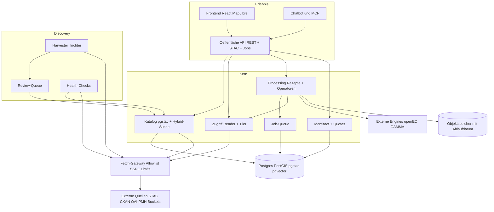
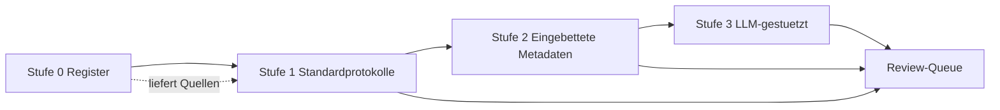
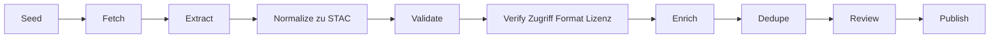
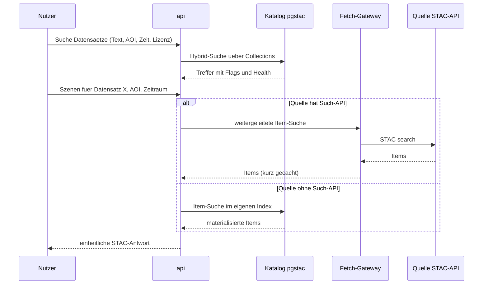
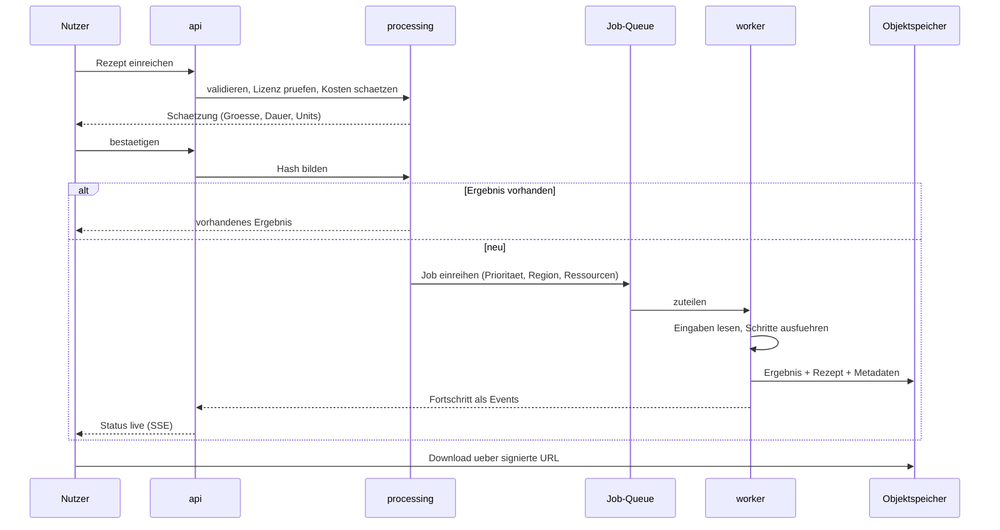

# EarthX — Architekturplan

> **Rangfolge:** Bei Widerspruch gilt `ENTSCHEIDUNGEN_2026-09-18.md`, danach `KLAERUNGEN.md`, danach dieses Dokument. Angepasst am 18.09.2026: Die sieben Hard Constraints sind aufgehoben, BIOMASS ist nicht Teil der Zielplattform.

Stand: 2026-09-18 · Version 1.1 (Entwurf zur Iteration; ergänzt um lokale Ausführung, Abschnitt 7.7)

Grundlage: überarbeitete Projektübersicht (Prinzipien 2.1 bis 2.16), bestehender Prototyp `biomass-viewer`, Recherche zum Stand der Technik (Quellen in Abschnitt 17). Der bisherige Phasenplan ist nicht berücksichtigt.

Einschränkung vorab: Das Repository wurde für diesen Plan nicht erneut inspiziert. Alle Aussagen zum bestehenden Code stützen sich auf die dokumentierten Entscheidungen. Abschnitt 14 listet, was vor der Umsetzung am echten Code zu prüfen ist.

---

## 0. Kurzfassung

Die Plattform besteht aus fünf Ebenen mit klaren Nahtstellen: **Discovery** (Quellen finden und Metadaten einsammeln), **Katalog** (normalisieren, durchsuchen, nach außen anbieten), **Zugriff** (lesen, kacheln, Downloads vermitteln), **Processing** (on-the-fly und Jobs) und **Erlebnis** (Frontend, API, Chatbot). Die zehn tragenden Entscheidungen:

1. **STAC ist das interne Metadatenmodell.** Jede Quelle, egal welches Protokoll, wird beim Einlesen auf STAC abgebildet. Damit ist "Standards raus" fast gratis.
2. **Zweistufiger Katalog: Collections ernten, Items föderieren.** Datensatz-Beschreibungen (tausende) liegen im eigenen Index. Einzelszenen (Milliarden) werden live bei der Quelle abgefragt und nur dort materialisiert, wo die Quelle keine Such-API hat.
3. **Quelle ≠ Format.** Adapter kümmern sich um Protokolle (STAC, CKAN, OAI-PMH, Bucket), Reader um Formate (COG, Zarr, virtualisierte Altformate). Beide Achsen variieren unabhängig.
4. **Discovery als Trichter: deterministisch zuerst, LLM zuletzt.** Register und Standardprotokolle vor eingebetteten Metadaten vor LLM-Extraktion. Jeder Treffer endet in einer Review-Queue.
5. **Ein einziges Tor nach außen (Fetch-Gateway).** Alle ausgehenden Requests laufen durch ein Modul mit Host-Allowlist, SSRF-Schutz, Limits pro Host und Backoff. Das ist zugleich Sicherheit und Rücksicht auf die Quellen.
6. **Das Rezept ist die zentrale Abstraktion im Processing.** Ein deklaratives JSON ist gleichzeitig Cache-Schlüssel, Provenienz, Permalink, Snippet-Vorlage, Grundlage der Kostenschätzung und das Einzige, was der Chatbot auslösen darf.
7. **Operator-Registry mit JSON-Schema.** Eine neue Processing-Methode ist ein registrierter Operator. Das Processing-Panel wird aus den Schemas generiert.
8. **Sechs Ausführungsstufen** hinter derselben Schnittstelle: Browser, Tiler (synchron), Worker (Job), lokaler Runner auf dem Rechner des Nutzers, Container (Modelle), externe Engine (openEO, GAMMA). Möglich wird das, weil der Worker-Kern eine reine Funktion ist: Rezept rein, Dateien raus.
9. **Eine Datenbank: Postgres** mit PostGIS, pgstac und pgvector für Katalog, Hybrid-Suche, Jobs und Konten. Kein separater Vektor- oder Suchdienst, solange die Mengen das nicht erzwingen.
10. **Modularer Monolith, vier Prozesstypen.** Ein Repo, ein Image, strikte Modulgrenzen; ausgerollt als `api`, `tiler`, `worker`, `harvester`. Lokal per docker compose identisch zur Cloud, jeder Prozesstyp einzeln skalierbar.

---

## 1. Rahmen

### 1.1 Qualitätsziele (priorisiert)

| # | Ziel | Bedeutung für die Architektur |
|---|---|---|
| 1 | Erweiterbarkeit | Neue Quelle, neues Format, neuer Operator, neue Engine jeweils ohne Änderung bestehender Module |
| 2 | Skalierbarkeit und Portabilität | Zustandslos, horizontale Skalierung pro Prozesstyp, nur portable Bausteine |
| 3 | Sicherheit | Jede externe Quelle und jeder externe Inhalt ist nicht vertrauenswürdig |
| 4 | Nachvollziehbarkeit | Jedes Ergebnis ist aus seinem Rezept reproduzierbar, jede Abweichung vom Original ist sichtbar |
| 5 | Kosteneffizienz | Wenig Egress, Compute nahe an den Daten, aggressives Caching, LLM nur wo nötig |
| 6 | Machbarkeit für 1 bis 3 Personen | Wenige bewegliche Teile, vorhandene Open-Source-Bausteine statt Eigenbau |

### 1.2 Feste Randbedingungen

- Keine dauerhafte Rohdatenhaltung; abgeleitete Produkte nur mit Ablaufdatum.
- Vorerst nur token-freie Datenquellen.
- Die fertige Plattform enthält nichts, was einen Token braucht; BIOMASS kommt darin nicht vor. Token-Logik (`auth.py`, MAAP-OIDC) wird nicht übernommen und nicht generalisiert.
- `decomp.py` wird als Operator mit Quad-Pol-Capability übernommen, nie als allgemeine Funktion.
- Zarr-Quellen bekommen `zarr_reader.py`, getrennt von `cog.py`; `DatasetConfig`-Registry in `datasets.py` mit `format`-Feld; Routen mit `dataset`-Argument.
- Das `DataSourceAdapter`-Interface wird nicht vorab designt. Dieser Plan legt deshalb nur **Nahtstellen und Zuständigkeiten** fest, keine Methodensignaturen.
- Stack bleibt: FastAPI/Python, React/Vite/TypeScript, MapLibre.

---

## 2. Erkenntnisse aus der Recherche

Was der Stand der Technik für die Architektur bedeutet:

| Thema | Befund | Konsequenz |
|---|---|---|
| Katalog-Backend | pgstac + stac-fastapi ist der etablierte Open-Source-Standard, in Produktion bis zu hunderten Millionen Items; Collection-Suche und Freitext-Suche sind als Extensions vorhanden. eoAPI bündelt pgstac, stac-fastapi, titiler-pgstac und tipg. | pgstac + stac-fastapi-pgstac als Katalogkern übernehmen, nicht selbst bauen. eoAPI als Referenz, nicht als Komplettübernahme (Begründung in 5.3). |
| Föderierte Suche | Zwei Muster existieren nebeneinander: zustandslose Weiterleitung an viele STAC-APIs (stac-fastapi-collection-discovery, im Einsatz bei MAAP) und periodisch geernteter Zentralindex (STAC Atlas von stacindex.org). | Hybrid: Collections ernten (Anreicherung nötig), Items föderieren (Frische, Menge). STAC Atlas und STAC Index sind Startpunkte für die Discovery. |
| Multi-Provider-Zugriff | EODAG abstrahiert Suche, Download und Auth über viele EO-Anbieter mit getrennten Plugin-Typen. stac-fastapi-eodag ist laut eigener Angabe nicht produktionsreif. | Die Dreiteilung Suche / Zugriff / Auth als Vorbild für die Adapter-Nahtstellen. EODAG als Bibliothek evaluieren, nicht als Dienst. |
| Zarr | ESA stellt Sentinel auf Zarr um (EOPF). Es gibt TiTiler-EOPF für serverseitiges Rendering und GeoZarr-Rendering im Browser (OpenLayers). Die GeoZarr-Spezifikation ist noch in Bewegung (seit März 2026 nur noch Zarr v3). | Zarr-Priorität ist richtig. Reader gegen Spezifikationsänderungen kapseln. |
| Virtuelles Zarr | VirtualiZarr + Icechunk machen Altformate (NetCDF, HDF5, GRIB, TIFF) als Zarr lesbar, indem nur Byte-Range-Verweise gespeichert werden, ohne Datenkopie. Icechunk speichert ETags und erkennt so Änderungen an der Quelle. | Passt exakt zu "keine Datenhaltung": gespeichert werden nur Verweise. Neue Stufe in der Format-Hierarchie (6.2) und Weg zum Datacube ohne Kopie. |
| Rendering im Browser | zarr-layer rendert Zarr direkt als MapLibre-Layer auf der GPU, ohne Tile-Server; Status: aktives Experiment, vor 1.0. | Als spätere Ausführungsstufe einplanen (null Serverkosten), Frontend-Layer-Abstraktion jetzt schon dafür offen halten. Voraussetzung: CORS an der Quelle. |
| Effizientes Lesen | async-geotiff/obstore (Rust-Kern) lesen COGs asynchron ohne GDAL; berichtet wird 25-fach schnelleres paralleles Metadaten-Parsing gegenüber rasterio. Kein Resampling, keine Reprojektion. | Für Massenoperationen (Zugriffs-Checks, Footprints, Header lesen) interessant. rasterio/rio-tiler bleibt für Pixelarbeit. |
| Processing-Standards | EOEPCA+ (ESA-Referenzarchitektur) kennt zwei Wege: OGC API Processes mit Application Packages (CWL) und openEO-Prozessgraphen. Es gibt openEO-Implementierungen auf FastAPI + Dask + Argo Workflows. | Rezept an openEO-Konzepte anlehnen, Job-API an OGC API Processes. Volle Implementierung erst bei Bedarf; externe Engines über diese Standards andocken. |
| Crawler mit LLM | Konsens der aktuellen Werkzeuge (Crawl4AI u. a.): deterministische Extraktion (CSS/XPath-Schema, einmal erstellt) ist schneller, gratis und halluziniert nicht; LLM nur für unregelmäßige Seiten, dann mit striktem Ausgabeschema. | Trichter in Abschnitt 4. LLM erzeugt bevorzugt einmalig das Extraktionsschema pro Portal statt jede Seite zu lesen. |
| Eingebettete Metadaten | Datenportale betten schema.org/Dataset bzw. Croissant als JSON-LD ein, bieten Signposting-Header und OAI-PMH; Google Dataset Search basiert darauf. | Eigene Discovery-Stufe vor jeder LLM-Nutzung. Umgekehrt: EarthX bettet selbst JSON-LD ein, um gefunden zu werden. |
| Job-Queues | Trend zu dauerhaften, Postgres-gestützten Queues mit Fairness und Rate Limits; Vergleiche stammen überwiegend von Anbietern und sind entsprechend gefärbt. | Nahtstelle `JobRunner` definieren, mit einfacher Postgres-Queue starten, Entscheidung per Spike (8.5). |
| Wo die Daten liegen | Copernicus-Daten liegen bei CloudFerro/Open Telekom Cloud; Zugriff von außerhalb verursacht Egress gegen ein Konto-Kontingent. Landsat und Sentinel-2-COGs liegen in AWS us-west-2. | Compute-Standort ist eine Eigenschaft des Datensatzes (`data_region`). Worker-Pools pro Region vorsehen, mit einer EU-Region starten. |
| Chatbot | STAC-MCP-Server und agentische Suche über EO-Kataloge sind 2026 verbreitet. | Chatbot als Client der öffentlichen API bauen; ein dünner MCP-Server darüber kostet fast nichts. |

**Einordnung gegenüber Bestehendem.** Teile der Vision existieren bereits einzeln: föderierte Collection-Suche (MAAP Discovery, STAC Atlas), Zarr-Visualisierung (EOPF Explorer), Cloud-Processing (CDSE openEO). Was es so nicht gibt, ist die Kombination aus anbieterübergreifendem Katalog inklusive Nicht-STAC-Quellen, kuratierter Lizenzprüfung, reproduzierbaren Rezepten und dialogischer Suche. Die Architektur nutzt die bestehenden Dienste als Zulieferer, statt sie nachzubauen.

---

## 3. Systemüberblick



### 3.1 Modulgrenzen (ein Python-Paket, strikte Importregeln)

| Modul | Zuständig für | Darf importieren |
|---|---|---|
| `gateway` | Alle ausgehenden HTTP/S3-Zugriffe | nichts Fachliches |
| `catalog` | STAC-Modell, pgstac, Suche, Lizenz- und Capability-Felder | `gateway` |
| `adapters` | Protokolle der Quellen: Discovery, Suche, Zugriffsauflösung | `gateway`, `catalog` (nur Modelle) |
| `readers` | Formate: `cog.py`, `zarr_reader.py`, später virtuelle Stores | `gateway` |
| `access` | Tiles, Quicklooks, Statistik, Download-Vermittlung | `readers`, `catalog` |
| `processing` | Rezepte, Operator-Registry, Kostenmodell, Provenienz | `access`, `readers`, `catalog` |
| `jobs` | Queue, Worker, Fortschritt, Ergebnisse | `processing` |
| `discovery` | Harvester, Normalisierung, Verifikation, Review | `adapters`, `catalog`, `gateway` |
| `identity` | Konten, API-Keys, Quotas, Audit | — |
| `api` | HTTP-Routen, setzt alles zusammen | alle |
| `datasets/<id>` | Datensatzspezifika, die kein generischer Operator abdeckt | bleibt isoliert, wird von nichts Generischem importiert |

Die Importregeln werden automatisch geprüft (z. B. import-linter in der CI). So bleibt der Monolith teilbar: Jedes Modul kann später ein eigener Dienst werden, ohne dass Code entflochten werden muss.

### 3.2 Prozesstypen (ein Image, vier Startbefehle)

| Prozess | Last | Skalierung | Zustand |
|---|---|---|---|
| `api` | I/O-lastig, async | horizontal, klein | keiner |
| `tiler` | CPU-lastig, kurze Requests | horizontal, stark elastisch; serverless-fähig | keiner, Tiles per HTTP-Cache/CDN |
| `worker` | CPU/RAM-lastig, lang | nach Queue-Länge; Pools pro Region und Ressourcentyp | keiner, Ergebnisse im Objektspeicher |
| `harvester` | I/O-lastig, geplant | wenige Instanzen | keiner, Fortschritt in Postgres |

---

## 4. Discovery-Ebene: der eigentliche "Datacrawler"

### 4.1 Grundsatz

Ein Crawler für Datensätze ist kein Web-Crawler. Fast alle relevanten Quellen bieten maschinenlesbare Metadaten an; HTML zu parsen ist die Ausnahme. Effizienz entsteht durch drei Dinge: die billigste ausreichende Methode pro Quelle, inkrementelles Arbeiten (nur Geändertes anfassen) und strikte Trennung von Holen, Extrahieren und Bewerten.

### 4.2 Der Trichter



| Stufe | Methode | Beispiele | Kosten | Verlässlichkeit |
|---|---|---|---|---|
| 0 | Register von Katalogen abfragen | STAC Index / STAC Atlas, re3data, data.europa.eu, AWS Open Data Registry (YAML auf GitHub), DataCite-API | minimal | hoch |
| 1 | Standardprotokoll ernten | STAC (Collection-Suche), CKAN-API, DCAT-AP (RDF), OAI-PMH, OGC API Records | gering | hoch |
| 2 | Eingebettete strukturierte Metadaten lesen | schema.org/Dataset und Croissant als JSON-LD, Signposting-Header, DOI-Content-Negotiation, Sitemaps | gering | mittel bis hoch |
| 3a | LLM erzeugt **einmalig** ein Extraktionsschema (CSS/XPath) pro Portal; danach deterministisch | Portale ohne Markup, aber mit einheitlichem Seitenaufbau | einmalig | mittel, per Stichprobe geprüft |
| 3b | LLM extrahiert pro Seite in ein striktes Schema | unregelmäßige Einzelseiten | hoch | niedrig, immer Review |

Regel: Eine Quelle wird auf der niedrigsten Stufe angebunden, die ausreicht. Stufe 3 wird erst gebaut, wenn Stufen 0 bis 2 ausgeschöpft sind.

### 4.3 Pipeline-Stufen



| Stufe | Aufgabe | Wichtige Details |
|---|---|---|
| Seed | Start-URLs und Quellen-Konfiguration | Quellen sind Konfiguration, nicht Code |
| Fetch | Holen über das Fetch-Gateway | robots.txt beachten, Limit pro Host, bedingte Requests (ETag, If-Modified-Since), Backoff, eigener User-Agent mit Kontaktadresse |
| Extract | Rohformat in Zwischenstruktur | pro Protokoll ein Extraktor; Rohantwort wird gespeichert |
| Normalize | Abbildung auf STAC Collection (+ Extensions) | verlustarm: unbekannte Felder bleiben unter `earthx:source_raw_ref` referenziert |
| Validate | Schema-Prüfung | STAC-Validator + eigene Pflichtfelder (Beschreibung, Lizenz, Zitierangabe) |
| Verify | Ist es wirklich offen und nutzbar? | anonymer HEAD/Range-GET auf Stichprobe der Assets (200 vs. 401/403), Format-Erkennung per Header, Lizenz-Klassifikation auf SPDX + Flags |
| Enrich | Anreichern | Footprint/Coverage, Capability-Flags, `data_region`, Embedding, Synonyme für Suche |
| Dedupe | Gleicher Datensatz, mehrere Fundorte | Schlüssel: DOI, dann kanonische URL, dann Titel + Herausgeber (unscharf). Ergebnis: **ein Datensatz, mehrere Distributionen** (Spiegel), mit Präferenz nach Format und Region |
| Review | Menschliche Freigabe | Pflicht bei neuer Quelle, neuer Lizenz, Stufe 3, Lizenzänderung; sonst Stichprobe |
| Publish | In den Katalog schreiben | versioniert; alte Version bleibt für Rezepte referenzierbar |

Eigenschaften, die die Pipeline effizient und robust machen:

- **Idempotent und inkrementell.** Jede Stufe ist über den Inhalts-Hash ihres Inputs geschlüsselt. Unveränderte Datensätze kosten bei einem erneuten Lauf nur den bedingten Request.
- **Roh speichern, normalisiert ableiten.** Die Rohantwort (kleines JSON/XML) bleibt erhalten. Ändert sich die Normalisierung, wird neu abgeleitet statt neu gecrawlt. Das sind Metadaten, keine Rohdaten im Sinne von Prinzip 2.1.
- **Zustandsautomat pro Datensatz.** `discovered → extracted → verified → in_review → published`, daneben `rejected`, `stale`, `broken`. Übergänge werden protokolliert; "zuletzt erfolgreich geprüft" ist ein sichtbares Feld im Katalog.
- **Fehlertoleranz pro Quelle.** Ein Circuit Breaker pro Host verhindert, dass eine ausgefallene Quelle die Pipeline blockiert oder weiter belastet wird.
- **LLM ohne Werkzeuge.** Das LLM in Stufe 3 bekommt Seiteninhalt als Daten, hat keine Tools und keinen Netzwerkzugriff, und seine Ausgabe wird gegen ein Schema validiert. Prompt Injection aus gecrawlten Seiten kann dadurch höchstens einen falschen Katalogeintrag vorschlagen, der im Review landet.

### 4.4 Review-Queue mit minimalem Aufwand

Für den Anfang ist die Review-Queue ein **Git-Workflow**: Kuratierte Datensätze liegen als YAML im Repo (Weiterentwicklung der `DatasetConfig`-Registry), der Harvester erzeugt Vorschläge als Dateien bzw. Pull Requests, Freigabe ist ein Merge. Beim Deploy werden die Definitionen nach pgstac geladen. Das liefert Versionierung, Diff-Ansicht und Vier-Augen-Prinzip ohne eigene Oberfläche. Eine Datenbank-gestützte Queue mit UI kommt erst, wenn das Volumen es verlangt; das Datenmodell (Abschnitt 10) sieht sie bereits vor.

### 4.5 Health-Checks

Getrennt vom Harvesting läuft ein leichter, häufiger Check pro veröffentlichtem Datensatz: Erreichbarkeit der API, Stichprobe eines Assets per Range-Request, Vergleich von ETag/Last-Modified. Ergebnis: Health-Status in der UI, `stale`/`broken`-Markierung, Alarm bei Lizenz- oder Strukturänderung. Für viele parallele Header-Abfragen eignet sich ein asynchroner Leser ohne GDAL (obstore/async-geotiff).

---

## 5. Katalog-Ebene

### 5.1 STAC als internes Modell

Jeder Datensatz ist eine STAC Collection, jede Szene ein STAC Item. Genutzte Extensions: `scientific` (DOI, Zitat), `version`, `datacube`, `raster`, `eo`, `sar`, `projection`, `processing`. Plattform-spezifische Felder liegen unter einem eigenen Präfix:

| Feld | Inhalt |
|---|---|
| `earthx:data_class` | Datentyp-Klasse (Raster-Zeitreihe, statisches Raster, ...) |
| `earthx:capabilities` | Flags: ROI, Zeitraum, Band-Math, Interpolation erlaubt, ML geeignet, ... |
| `earthx:license_flags` | `commercial_use`, `derivatives`, `share_alike`, `attribution_required` + SPDX-Kennung |
| `earthx:access` | token-frei geprüft am, Methode, CORS vorhanden |
| `earthx:distributions` | Fundorte/Spiegel mit Format, Region, Präferenz |
| `earthx:health` | Status, zuletzt erfolgreich geprüft |
| `earthx:default_render` | Standard-Visualisierung in den Feldnamen der STAC-`render`-Extension (`title`, `assets`, `rescale`, `colormap_name`, `expression`, `resampling`) |
| `earthx:viewer` | Was der Viewer aus dem Katalog nimmt statt aus eigenem Code. In M2 drei Felder. `group_by`, der Gruppierungsschlüssel der Zeitleiste — Item-Eigenschaften in Schlüsselreihenfolge, `properties.` ist impliziert; eine Eigenschaft mit einem STAC-Zeitpunkt geht als ihr **UTC-Datum** in den Schlüssel ein. Für Sentinel-2: `["datetime", "grid:code"]`. Dazu `min_zoom` und `max_zoom`, die für diesen Datensatz freigegebenen Kachelstufen (M2-10): unterhalb zeigt eine Kachel mehrere Szenen — Sache der Coverage-Karte, nicht des Kachelpfads —, oberhalb hat die Quelle nichts Feineres und der Client überzoomt die letzte Stufe. Alle drei ohne Vorgabewert (B10); die Kachelroute weist eine Stufe außerhalb der Spanne mit `400` ab, das Feld ist also die Grenze des Kachelpfads und keine Empfehlung an einen gutwilligen Client |
| `earthx:source` | Adapter-Typ, Quell-ID, Harvest-Lauf |
| `earthx:maturity` | Wie vorläufig die Quelle selbst ist (`stable`, `staging`, `experimental`), ohne Vorgabewert — Teil der Wahrheit über den Datensatz wie Lizenz und Attribution, keine Messung wie `earthx:health` |

Nicht-STAC-Quellen (CKAN, Zenodo/OAI-PMH, DCAT, Buckets) werden beim Einlesen übersetzt. Für reine Forschungsdaten-Records ohne Szenenstruktur gilt: eine Collection mit wenigen Items (die Dateien).

### 5.2 Zweistufiger Katalog



| | Collections | Items |
|---|---|---|
| Menge | tausende | bis Milliarden |
| Haltung | geerntet, angereichert, im eigenen pgstac | föderiert: Live-Abfrage der Quelle, kurzer Cache |
| Warum | Lizenz-Flags, Capabilities, Embeddings, Health gibt es nur bei uns | Frische, keine Synchronisation, keine Speicherkosten |
| Ausnahme | — | Quellen ohne Such-API (statische Buckets, Zenodo-Dateien, Tile-adressierte Quellen): Items werden einmalig erzeugt und im eigenen pgstac materialisiert; für große statische Bestände alternativ stac-geoparquet |

Für den Nutzer und die API ist der Unterschied unsichtbar: Beide Wege liefern dieselbe STAC-Antwort. Das Fallback "nächstgelegenes Datum" und die Verfügbarkeits-Zeitleiste sind Abfragen auf dieser Schicht (Aggregation über `datetime`), nicht Logik im Frontend.

### 5.3 Bausteine

- **pgstac + stac-fastapi-pgstac** als Katalogkern und zugleich öffentliche STAC-API (Collection-Suche, Freitext, CQL2-Filter).
- **Nicht** eoAPI komplett übernehmen: titiler-pgstac baut Mosaike aus Items, die in pgstac liegen. Bei föderierten Items liegen sie dort meist nicht. Mosaike aus Suchergebnissen einer fremden STAC-API brauchen ein eigenes Mosaik-Backend im Tiler (6.3). eoAPI bleibt Referenz für Deployment und Konfiguration.
- **Hybrid-Suche in Postgres:** Volltext (tsvector) + Vektorähnlichkeit (pgvector) + strukturierte Filter (Raum, Zeit, Lizenz-Flags, Capabilities), zusammengeführt per Reciprocal Rank Fusion. Embedding-Text: Titel, Beschreibung, Schlagworte, Variablen/Bänder, Plattform/Instrument, kuratierte Synonyme (z. B. "Waldverlust" ↔ "forest loss" ↔ "deforestation").
- **Selbst auffindbar sein:** Jede Datensatzseite bettet schema.org/Dataset als JSON-LD ein und steht in einer Sitemap.

---

## 6. Zugriffs-Ebene

### 6.1 Adapter-Nahtstellen (ohne Signaturen)

Vorbild ist die Plugin-Trennung von EODAG. Ein Adapter deckt mehrere **getrennte** Fähigkeiten ab; nicht jede Quelle braucht alle, und die Liste ist **nicht abschließend** — sie wächst mit den realen Quellen:

| Fähigkeit | Frage, die sie beantwortet | Genutzt von |
|---|---|---|
| Discovery | Welche Datensätze gibt es bei dieser Quelle, mit welchen Metadaten? | `discovery` |
| Suche | Welche Szenen gibt es für AOI und Zeitraum? | `catalog` (Föderation) |
| Zugriffsauflösung | Welche lesbare Adresse und welcher Reader gehören zu diesem Asset? | `access`, `processing` |
| Aggregation (optional) | Wie viele Aufnahmen liegen je Rasterzelle und je Zeitschritt unter Filter F? | `catalog` (Coverage Map) |

Aggregation ist die vierte Fähigkeit, entschieden am 19.09.2026 mit `adr/0004`. Sie ist **optional**: Bringt eine Quelle sie nicht mit (Earth Search tut es über die STAC-Aggregation-Extension, andere nicht), ist die Rückfallebene eine **ausgewiesene Stichprobe** — die Antwort trägt dann sichtbar den Wert `stichprobe`, statt Vollständigkeit vorzutäuschen (`adr/0004` §5, Regel V). Das quellenspezifische Protokollwissen liegt in `adapters`, die Nahtstelle und das SQL für eigene Items in `catalog`.

Auth ist bewusst eine spätere Fähigkeit (Token pro Connector) und in der Zielarchitektur zunächst nicht vorhanden. Die konkreten Signaturen entstehen, wie beschlossen, aus den ersten zwei bis drei realen Quellen. Damit das Interface nicht STAC-förmig wird, muss darunter eine Nicht-STAC-Quelle sein.

### 6.2 Reader und erweiterte Format-Hierarchie

Reader hängen am Format, nicht an der Quelle. Dispatch über das `format`-Feld, wie bereits entschieden.

| Rang | Format | Reader | Bemerkung |
|---|---|---|---|
| 1 | Zarr (GeoZarr, EOPF) | `zarr_reader.py` auf xarray/zarr; Bausteine aus titiler-xarray bzw. TiTiler-EOPF prüfen | Spezifikation in Bewegung, daher kapseln |
| 2 | COG | `cog.py` auf rio-tiler | besteht |
| 3 | Virtualisiertes Altformat | virtueller Zarr-Store (VirtualiZarr + Icechunk), gelesen über denselben Zarr-Reader | gespeichert werden nur Byte-Range-Verweise; ETags zeigen Quelländerungen |
| 4 | Altformat ohne Range-Zugriff | kein Reader; nur Katalogeintrag und vermittelter Download | ehrlich als "nur Download" kennzeichnen |

Rang 3 ist der architektonisch wichtigste Fund der Recherche: Er erlaubt Cloud-nativen Zugriff auf NetCDF-, HDF5-, GRIB- und einfache TIFF-Archive **und** virtuelle Datacubes über viele Einzeldateien, ohne dass die Plattform ein einziges Pixel kopiert. Die Verweis-Manifeste sind klein und gehören zur Metadaten-Schicht.

### 6.3 Tiler

- Der `tiler`-Prozess liefert Tiles, Quicklooks, Punktabfragen, Zeitreihen am Punkt und Statistik pro Polygon.
- Empfehlung: neue Endpunkte auf den **TiTiler-Fabriken** aufbauen (gleiche Basis wie das vorhandene rio-tiler, ebenfalls FastAPI). Das bringt Ausdrücke/Band-Math, Colormaps, Rescaling, Algorithmen und OGC-konforme Tile-Endpunkte mit, statt sie einzeln nachzubauen.
- Mosaike über mehrere Szenen: eigenes Mosaik-Backend, das eine (föderierte) Item-Suche als Eingabe nimmt; Suchergebnis wird unter einer Such-ID kurz gecacht, damit Tile-URLs stabil und CDN-fähig sind.
- Tile-URLs enthalten alle Parameter (oder eine Rezept-ID) und sind damit vollständig per HTTP cachebar.
- GDAL-Konfiguration für Fernzugriff zentral setzen (kein Directory-Listing beim Öffnen, Zusammenfassen benachbarter Ranges, HTTP/2-Multiplexing, Header-Cache).

### 6.4 Download-Vermittlung

- Rohdaten: Link oder Redirect direkt zur Quelle. Kein Byte läuft durch das eigene Backend.
- Verarbeitete Ergebnisse: Objektspeicher mit Ablaufdatum, Auslieferung über signierte URLs.
- Jeder Download bekommt Attribution, Lizenztext-Verweis, Zitierangabe (BibTeX) und das Rezept als Begleitdatei.

**Nachtrag 2026-09-20 (D3):** Der AOI-Zuschnitt in M2 nimmt diesen Weg noch
nicht. Er wird synchron aus den Quell-Assets gestreamt und nirgends
gespeichert — kein Objektspeicher, keine signierte URL, kein Rezept als
Begleitdatei. Ausgeliefert wird ein ZIP aus COG und Textdatei mit Attribution,
`terms_notice`, `terms_url` und Zitierangabe; ein Größendeckel greift vor dem
Lesen. Objektspeicher mit Ablauf, signierte URLs und das Rezept als
Begleitdatei für Downloads bleiben M4.

### 6.5 Fetch-Gateway

Einziger Weg nach außen für `adapters`, `readers`, `discovery` und Health-Checks:

- Host-Allowlist aus den registrierten Quellen; nur `https` (und `s3` für bekannte Buckets).
- SSRF-Schutz: DNS-Auflösung prüfen, private und Link-Local-Adressen sperren, Redirects nur innerhalb der Allowlist, Größen- und Zeitlimits.
- Pro Host: Obergrenze paralleler Verbindungen, Token-Bucket, exponentielles Backoff, Circuit Breaker.
- Request-Bündelung: Identische gleichzeitige Anfragen (z. B. derselbe COG-Header für hundert Tiles) werden zusammengelegt.
- Metriken pro Host: Latenz, Fehlerquote, Volumen. Das ist zugleich die Datengrundlage für den Health-Status.

Dieses eine Modul setzt drei Prinzipien gleichzeitig um: Security by Design, Rücksicht auf die Quellen, Kostenbewusstsein.

---

## 7. Processing-Ebene

### 7.1 Das Rezept

Ein Rezept ist ein deklaratives, kanonisch serialisierbares JSON-Dokument:

```json
{
  "recipe_version": 1,
  "inputs": [
    {"dataset": "sentinel-2-l2a-zarr", "dataset_version": "2026-08",
     "items": ["S2B_..."], "assets": ["b04", "b08"], "etag": "…"}
  ],
  "aoi": {"type": "Polygon", "coordinates": []},
  "time": {"mode": "exact"},
  "steps": [
    {"op": "band_math", "params": {"expr": "(b08-b04)/(b08+b04)"}},
    {"op": "reproject", "params": {"crs": "EPSG:2056", "resolution": 10, "resampling": "bilinear"}},
    {"op": "mask", "params": {"source": "scl", "classes": [3, 8, 9, 10]}}
  ],
  "output": {"format": "cog"}
}
```

Aus diesem einen Objekt folgt:

| Funktion | Wie |
|---|---|
| Cache / Idempotenz | Hash des kanonischen Rezepts ist der Schlüssel; identische Anfrage liefert das vorhandene Ergebnis |
| Provenienz | Rezept + Softwareversionen + ETags der Eingaben werden mit dem Ergebnis gespeichert und ausgeliefert |
| Permalink | Rezept-ID in der URL stellt Ansicht und Einstellungen wieder her |
| Python-Snippet | Generator übersetzt das Rezept in Client-Code |
| Kostenschätzung | Kostenmodelle der Operatoren × Pixelzahl aus AOI und Auflösung, vor dem Start |
| Parameter übernehmen | "Werte von Datensatz X übernehmen" kopiert Schritte oder einzelne Parameter zwischen Rezepten |
| Chatbot-Sicherheit | Der Bot erzeugt Rezepte, nie Code; ausgeführt wird nur, was die Operator-Registry kennt |
| Ehrlichkeit | Jeder Schritt, der vom Original abweicht, steht im Rezept und damit in UI und Metadaten |
| Lizenzprüfung | Kombination der `license_flags` aller Eingaben wird vor Ausführung geprüft |

Das Rezept lehnt sich konzeptionell an openEO-Prozessgraphen an (benannte Prozesse mit Parametern, gerichtete Abfolge). Eine Übersetzung Rezept → openEO-Prozessgraph ist damit später machbar, ohne jetzt die volle openEO-API zu implementieren.

### 7.2 Operator-Registry

Jeder Operator ist eine registrierte Einheit mit:

- Name, Kategorie (bestimmt den Reiter im Processing-Panel), Beschreibung, Zitierangabe.
- **Parameter als JSON-Schema.** Daraus generiert das Frontend das Formular; daraus validiert das Backend das Rezept.
- Anwendbarkeit: benötigte Capabilities und Datentyp-Klassen (z. B. Interpolation nur bei `interpolation_allowed`).
- Ausführungsstufen, auf denen er laufen kann (7.3).
- Kostenmodell (Processing Units pro Megapixel o. ä.).
- Metadaten-Transformation: wie der Operator STAC-Felder des Ergebnisses verändert (CRS, Auflösung, Bänder, `processing:`-Felder). So stimmen die Metadaten nach jedem Schritt automatisch.

Eine neue Methode hinzuzufügen heißt: einen Operator registrieren. Kein Frontend-Code, keine neue Route. Modelle aus der Modell-Registry sind Operatoren der Stufe T3 mit Pflichtfeld Paper-Referenz und deklarierter Trainingsdomäne (Grundlage der Domain-Shift-Warnung). Polarimetrische Dekompositionen bleiben Operatoren mit Quad-Pol-Capability im isolierten Datensatz-Modul.

### 7.3 Ausführungsstufen

| Stufe | Wo | Wofür | Grenze |
|---|---|---|---|
| T0 | Browser (WebGL/WebGPU, später WASM) | Darstellung, einfache Band-Math auf Zarr mit CORS | später; nur Anzeige, kein zitierfähiges Ergebnis |
| T1 | `tiler`, synchron | alles, was pro Kachel rechenbar ist: Band-Math, Stretch, Colormap, einfache Filter | Kachelgröße, Sekundenbruchteile |
| T2 | `worker`, asynchroner Job | AOI-weite Verarbeitung: Reprojektion, Resampling, Masking, Normalisierung, Datacube, zeitliche Angleichung, zonale Statistik | AOI-Limit und Quota |
| T2L | Lokaler Runner beim Nutzer (derselbe Worker-Kern als Container oder Paket) | alles, was T2 kann; Nutzer wählt pro Job zwischen Cloud und lokal | Rechner und Bandbreite des Nutzers; Ergebnis ist selbst bezeugt (7.7) |
| T3 | Container-Job | ML- und physikalische Modelle; isoliert, ohne Netzwerk, definierte Ein-/Ausgabeordner + Manifest, optional GPU | pro Modell einmal gebauter Wrapper |
| T4 | Externe Engine | openEO-Backends, GAMMA oder andere Partner | über `ProcessingBackend`-Nahtstelle, bevorzugt openEO / OGC API Processes |

Ein Planer zerlegt ein Rezept: zusammenhängende T1-fähige Schritte werden in Tile-Parameter übersetzt (Vorschau auf der Karte), der Rest wird ein Job. Dieselbe Operator-Implementierung bedient T1 und T2, damit Vorschau und Ergebnis übereinstimmen.

**Regel für den Worker-Kern.** Der Kern, der ein Rezept ausführt, ist eine reine Funktion: Eingabe sind Rezept und aufgelöste Asset-Adressen, Ausgabe sind Dateien, Metadaten und Provenienz. Er kennt weder Datenbank noch Queue noch Objektspeicher noch interne Dienste. Queue-Anbindung, Upload und Fortschrittsmeldung sind eine dünne Hülle darum. Diese Regel gilt ab dem ersten Operator, weil sie nachträglich teuer ist; sie macht T2, T2L und T3 zu drei Hüllen um denselben Kern.

T2 technisch: Laden über xarray (odc-stac bzw. rioxarray für COG, zarr für Zarr), lazy und chunk-weise, Dask lokal im Worker. Verteiltes Dask erst, wenn einzelne Jobs einen Worker sprengen.

### 7.4 Ablauf eines Jobs



### 7.5 Job-Orchestrierung

Anforderungen, an denen jede Lösung gemessen wird: dauerhaft (übersteht Neustarts), transaktionales Einreihen zusammen mit der Job-Zeile, Fairness pro Nutzer, Prioritäten (Free/Pro), Abbruch, Wiederholungen, Fortschritts-Events, Worker-Pools nach Region und Ressourcentyp, globale Limits pro Upstream-Host.

Empfehlung: Nahtstelle `JobRunner` definieren und mit einer **Postgres-gestützten Queue** starten (kein zusätzlicher Dienst, transaktional mit den Job-Daten; z. B. Procrastinate oder eine schlanke `SKIP LOCKED`-Implementierung). Container-Jobs (T3) laufen nach der Cloud-Migration als Kubernetes-Jobs bzw. über Argo Workflows, wie es EOPF Explorer und openEO-Referenzimplementierungen tun. Celery/Redis, Hatchet oder Temporal sind Alternativen; ein kurzer Spike mit den obigen Anforderungen entscheidet (15.2).

### 7.6 Schnittstelle nach außen

Die Job-Endpunkte folgen in Form und Vokabular **OGC API Processes** (`/processes`, `/processes/{id}/execution`, `/jobs/{id}`, `/jobs/{id}/results`). Operatoren erscheinen als Prozesse. Das kostet beim Eigenbau in FastAPI kaum Mehraufwand und macht die Plattform für Standard-Clients und Partner-Engines ansprechbar.

### 7.7 Lokale Ausführung (Runner)

Der Nutzer kann pro Job zwischen Cloud und lokal wählen. Lokal heißt: Derselbe Worker-Kern läuft als Container auf seinem Rechner, lädt die Daten direkt von den Originalquellen und schreibt das Ergebnis in einen lokalen Ordner. Das funktioniert, weil Rezepte deklarativ und die Quellen token-frei sind.

```bash
docker run --rm -v "$PWD/ergebnis:/out" ghcr.io/earthx/runner:1.4 run r_abc123
```

| Modus | Ablauf | Verbindung zur Plattform |
|---|---|---|
| Einmalbefehl mit Rezept-ID | Runner holt das Rezept über die öffentliche API, rechnet, beendet sich | nur Rezept und Asset-Auflösung |
| Offline mit Rezeptdatei | Rezept (inkl. aufgelöster Adressen) vorher heruntergeladen: `run /in/rezept.json` | keine |
| Verbunden | Runner läuft dauerhaft (`runner connect --token …`), holt Jobs ab, die in der Oberfläche auf "Lokal" gestellt wurden; meldet nur Status und Metadaten zurück | ausgehend, Runner fragt selbst nach Arbeit; keine offenen Ports |

In der Oberfläche steht neben "In der Cloud ausführen" die Option "Lokal ausführen" mit dem fertigen Befehl zum Kopieren; die Kostenschätzung zeigt beide Wege nebeneinander (Units und Dauer gegen Downloadmenge und geschätzte Rechenzeit).

Festlegungen:

- **Version festnageln.** Der Befehl enthält immer ein festes Image-Tag, nie `latest`. Das Rezept vermerkt die Runner-Version. Gleiches Rezept + gleiche Version ergibt ein reproduzierbares, mit der Cloud vergleichbares Ergebnis.
- **Provenienz ehrlich kennzeichnen.** Lokal erzeugte Ergebnisse tragen `execution: local, runner_version, self_attested: true`. Die Plattform kann sie nicht überprüfen; sie haben deshalb nicht denselben Status wie Cloud-Ergebnisse (z. B. kein Eintrag im gemeinsamen Ergebnis-Cache).
- **Images schlank halten.** Basis-Image für Standard-Operatoren (GDAL + Python, grob ein Gigabyte); Modelle als eigene Images, die bei Bedarf nachgezogen werden. GPU über `--gpus all`.
- **Cache-Volume.** Ein zweites Volume für heruntergeladene Chunks, damit Wiederholungen nicht alles neu laden.
- **Verteilung.** Container als Standardweg; zusätzlich ein pip/conda-Paket für Standard-Operatoren (niedrigere Hürde unter Windows). Auf Rechenclustern ohne Docker läuft dasselbe Image über Apptainer. Ein kleines Wrapper-Skript verkürzt den Aufruf auf `earthx run r_abc123`.
- **Anzeige des Ergebnisses.** Entweder lädt der Browser die lokale Datei direkt, oder der Runner startet einen kleinen Tile-Server auf localhost, den die Layer-Abstraktion (8.2) als weitere Quelle einbindet. Browser-Regeln für Zugriffe von einer https-Seite auf localhost sind zu testen (15.2).
- **Modelle lokal.** Gewichte lokal auszuliefern berührt deren Lizenz; pro Modell in der Registry als Flag `local_execution_allowed` führen.
- **Lizenz und Geschäftsmodell.** Lokal ist gratis und verbraucht keine Units; bezahlt wird für Bequemlichkeit und Skalierung in der Cloud. Beim lokalen Pfad bezieht der Nutzer die Daten selbst von der Quelle; ob das die offene NC-Frage für diesen Pfad entschärft, ist rechtlich zu prüfen.
- **Nebeneffekte.** Zugriffe kommen von der IP des Nutzers und entlasten das Fetch-Gateway; AOI und Ergebnis verlassen den Rechner nicht.

Abgrenzung: T0 (Browser) bleibt auf Anzeige und leichte Operatoren beschränkt, weil dort eine zweite Implementierung der Operatoren nötig wäre. T2L nutzt denselben Code wie die Cloud und liefert deshalb gleichwertige Ergebnisse.

---

## 8. Erlebnis-Ebene

### 8.1 Öffentliche API (API-first)

- Drei Flächen: STAC-API (Katalog), Tiles/Statistik (Zugriff), Processes/Jobs (Processing). Dazu Konto/Quota.
- Das Frontend nutzt ausschließlich diese API. Ein TypeScript-Client wird aus dem OpenAPI-Schema generiert; was das Frontend braucht, existiert damit zwangsläufig auch für Python, QGIS und den Chatbot.
- QGIS: STAC-Endpunkt und XYZ/COG-URLs genügen für den Anfang.

### 8.2 Frontend

- Trennung von Server-Zustand (Abfragen, Cache; z. B. TanStack Query) und UI-/Kartenzustand (bestehendes `store.ts`).
- **Layer-Abstraktion** mit Quelltypen: `tiles` (vom Tiler), `client-zarr` (später zarr-layer), `footprints` (Vektor). Layer Manager, Swipe-Vergleich und Export arbeiten gegen die Abstraktion, nicht gegen einen Quelltyp.
- Processing-Panel: generiert aus den Operator-Schemas, gruppiert nach Kategorie.
- Gesamter Arbeitszustand ist als Rezept + Ansicht serialisierbar (Permalink).
- Pixel-Inspektor, Zeitreihe und Zeitleiste sind reine API-Aufrufe.

### 8.3 Chatbot

- Tool-Calling gegen die öffentliche API mit wenigen, schmalen Werkzeugen: `search_collections`, `get_collection`, `check_availability(aoi, time)`, `propose_recipe`, `estimate_cost`. Kein Werkzeug startet Jobs ohne Bestätigung des Nutzers.
- Ablauf: Rückfragen → strukturierte Filter + semantische Suche → Re-Ranking → begründete Empfehlung mit Lizenz- und Verfügbarkeitshinweis.
- Bewertungs-Set aus echten Anfragen mit erwarteten Datensätzen; läuft als Regressionstest bei jeder Änderung an Suche, Embeddings oder Prompt.
- Ein dünner **MCP-Server** über der öffentlichen API macht EarthX in externen Assistenten nutzbar; fast kein Zusatzaufwand, weil die Werkzeuge identisch sind.
- "Datensätze außerhalb der Plattform finden": Der Bot stößt einen Discovery-Lauf (Abschnitt 4) für eine vorgeschlagene Quelle an; das Ergebnis geht in die Review-Queue, nicht direkt in den Katalog.

---

## 9. Identität, Quotas, Abrechnung

- OIDC-basierter Login (selbst gehosteter Identity-Provider oder verwalteter Dienst). Das Backend prüft nur signierte Tokens und bleibt zustandslos.
- Anonyme Nutzung mit IP-basierten Limits, falls die offene Entscheidung zur Registrierungspflicht so ausfällt; die Architektur trägt beides.
- API-Keys pro Nutzer, gehasht gespeichert.
- **Processing Units** als einheitliche Verbrauchswährung (Vorbild: Kontingentmodell der Copernicus-Dienste): Kostenmodelle der Operatoren → Schätzung vor dem Job → Abbuchung nach Abschluss in einem Quota-Ledger. Freemium und spätere Bezahl-Tiers sind dann nur andere Kontingente.
- Lizenz-Flags wirken hier mit: Eingaben mit `commercial_use = false` sind für kostenpflichtige Operatoren gesperrt, bis die Rechtsfrage geklärt ist.

---

## 10. Datenmodell (Postgres)

| Bereich | Tabellen (Auszug) | Anmerkung |
|---|---|---|
| Katalog | pgstac-Schema (Collections, Items), `dataset_embedding`, `license_catalog` | `earthx:`-Felder liegen im Collection-JSON |
| Quellen | `source`, `distribution`, `health_check` | Quelle = Konfiguration + Adapter-Typ + erlaubte Hosts |
| Discovery | `harvest_run`, `raw_record`, `record_state`, `review_item` | Rohantworten mit Inhalts-Hash |
| Virtuelle Stores | `virtual_store` | Verweis auf Icechunk-Repo im Objektspeicher, Quell-ETags |
| Processing | `operator` (gespiegelt aus Code), `recipe`, `job`, `job_event`, `result`, `runner` | `result.expires_at` steuert das Aufräumen; `job.execution_target` (cloud/local), `result.self_attested`; `runner` nur für den verbundenen Modus |
| Identität | `user`, `api_key`, `quota_ledger`, `audit_log` | getrenntes Schema, eigene DB-Rolle |

Regeln: Migrationen versioniert (Alembic); jede Komponente hat eine eigene DB-Rolle mit minimalen Rechten; personenbezogene Daten (Konto, AOIs in Rezepten, Suchanfragen) sind markiert und haben Aufbewahrungsfristen; Logs enthalten keine exakten AOIs.

---

## 11. Sicherheitsarchitektur

| Angriffsfläche | Maßnahme |
|---|---|
| URLs aus fremden Katalogen (SSRF) | Fetch-Gateway (6.5) als einziger Ausgang; Netzwerk-Policy verbietet anderen Prozessen direkten Internetzugang |
| Präparierte Rasterdateien | Treiber-Allowlist für GDAL, Größen- und Zeitlimits, Reader in Prozessen ohne Schreibrechte und ohne Secrets |
| Modell-Container | kein Netzwerk, nur Ein-/Ausgabeordner, Ressourcenlimits, Images signiert und gescannt |
| Lokaler Runner (umgekehrtes Vertrauen: Nutzer führt unseren Code aus) | signierte, gescannte Images mit festen Tags; läuft als Nicht-Root; nur Ausgabe- und Cache-Ordner gemountet; nur ausgehende Verbindungen; führt ausschließlich Rezepte mit bekannten Operatoren aus, nie Code von der Plattform; Token im verbundenen Modus eng begrenzt und widerrufbar |
| Chatbot | erzeugt nur Rezepte und API-Aufrufe; externe Inhalte sind als Daten markiert; Jobstart nur mit Nutzerbestätigung |
| Crawler-LLM | keine Werkzeuge, Schema-validierte Ausgabe, Review |
| Tile- und Job-Endpunkte | Rate Limits, AOI-Limits, Kostenschätzung als Schranke |
| Konten | OIDC, kurze Token-Laufzeiten, gehashte API-Keys, Audit-Log |
| Ergebnisse | signierte URLs mit kurzer Laufzeit, Ablaufdatum |
| Lieferkette | gepinnte Abhängigkeiten, automatischer Scan in der CI |

---

## 12. Deployment, Skalierung, Beobachtbarkeit

### 12.1 Topologie

Lokal (docker compose) und Cloud sind identisch aufgebaut: `api`, `tiler`, `worker`, `harvester`, Postgres, S3-kompatibler Objektspeicher (lokal MinIO), optional Redis als Cache. Konfiguration nur über Umgebungsvariablen. Für die Cloud: Container-Plattform oder Kubernetes, verwaltetes Postgres, CDN vor dem Tiler.

Dieselbe compose-Topologie (`docker compose up`) ist zugleich die Grundlage für eine mögliche selbst gehostete Ausgabe für Institute oder Behörden, die Flächen und Ergebnisse nicht aus dem Haus geben dürfen. Das ist kein Ziel, aber eine Option, die die Architektur ohne Mehraufwand offen hält. Für einzelne Nutzer ist der Runner (7.7) der richtige Weg, nicht die ganze Plattform.

### 12.2 Compute folgt den Daten

`data_region` am Datensatz + Worker-Pools pro Region. Start mit einem EU-Standort. Für Copernicus-lastige Nutzung sind die Clouds, in denen die Copernicus-Daten liegen, der naheliegende Kandidat (Datennähe, EU-Standort). Für Bestände in AWS us-west-2 kann später ein zweiter Worker-Pool dort laufen; Katalog, API und Konten bleiben in der EU. Der Tiler ist wegen kurzer, zustandsloser Requests der beste Kandidat für serverloses Skalieren.

### 12.3 Caching-Ebenen

| Ebene | Inhalt | Ort |
|---|---|---|
| HTTP/CDN | Tiles, Quicklooks, Katalogantworten | CDN / Browser |
| Anwendung | föderierte Item-Suchen, Such-IDs für Mosaike, Header-Infos von COGs | Redis oder Postgres |
| Ergebnis | Job-Ergebnisse per Rezept-Hash | Objektspeicher mit Ablaufdatum |
| Pipeline | Rohantworten der Quellen per Inhalts-Hash | Postgres |

### 12.4 Beobachtbarkeit

OpenTelemetry-Traces über `api → tiler/worker → gateway → Quelle`; Metriken: Latenz und Fehlerquote pro Upstream-Host, Cache-Trefferquoten, Queue-Länge und Wartezeit, Units pro Nutzer, Harvest-Durchsatz, Anteil `stale`/`broken`. Lasttests mit simulierten gleichzeitigen Nutzern vor der Migration; das erwartbar erste Limit sind die Quellen, nicht die eigenen Server.

---

## 13. Abbildung auf den bestehenden Code

| Bestehend / entschieden | Rolle in der Zielarchitektur |
|---|---|
| Prototyp gesamt (historisch) | Entfernt (`adr/0008-prototyp-entfernen.md`, 2026-09-22): 17 von 21 Funktionen liefen bereits token-frei in `earthx`, die restlichen vier sind durch eigene Entscheidungen verschoben oder ersatzlos gelöst. Referenz bleibt der Tag `prototype-biomass`, nicht mehr der Arbeitsbaum |
| `cog.py` | erster Reader in `readers` |
| `zarr_reader.py` (neu) | zweiter Reader; später auch für virtuelle Stores |
| `datasets.py` / `DatasetConfig` mit `format` | Keim des Katalogs: wird zu kuratierten YAML-Definitionen, die nach pgstac geladen werden; `format` bleibt der Reader-Dispatch |
| `stac.py` | Vorlage für den ersten Adapter (Fähigkeiten Suche + Zugriffsauflösung), neu gegen eine token-freie STAC-Quelle |
| `auth.py` (Bearer aus `.env`) | wird **nicht** übernommen: kein Token in der Zielarchitektur, nicht generalisieren |
| `store.py` | auf Zustand im Prozessspeicher prüfen; Kandidat für Ersatz durch Cache/DB |
| `/api/coverage` | Vorlage für die Pflicht-Footprints aller Datensätze |
| `decomp.py` | Operator mit Quad-Pol-Capability im isolierten Datensatz-Modul; nie generalisiert. Ruht mit synthetischen Tests, bis eine token-freie Quelle für komplexe Quad-Pol-Daten gefunden ist |
| `ControlPanel.tsx`, `store.ts` | Generalisierung wie entschieden; Processing-Teil später aus Operator-Schemas generiert |
| Funktionen und Designentscheidungen des Prototyps | AOI-Auswahl, Quicklook-Overlays mit Zeitleiste, Auswahl-/Bestätigungsablauf, AOI-Zuschnitt über partielle COG-Reads, zweistufige Anzeige, Stitching, Coverage Map, LRU-Disk-Cache, dunkles Kartendesign mit Theme-Umschalter, polarimetrische Auswertung — werden auf token-freie Datensätze übertragen (ENTSCHEIDUNGEN §2) |

Vorgehen nach dem Strangler-Muster: Neues entsteht neben dem Bestehenden hinter denselben Routen-Präfixen. Bestehender Code darf dabei umgebaut, verschoben und umbenannt werden. Der Prototyp selbst ist entfernt, sobald seine Funktionen token-frei liefen (`adr/0008-prototyp-entfernen.md`); als Referenz bleibt der Tag `prototype-biomass`.

---

## 14. Vor der Umsetzung am Code zu prüfen

1. Wo hält der Prototyp Zustand im Speicher oder Dateisystem?
2. Funktions- und Design-Inventar: Welche Funktionen und Designentscheidungen gibt es, wie sind sie gelöst, was ist BIOMASS-spezifisch, was ist übertragbar? (M0 Schritt 3)
3. Wie stark sind die rio-tiler-Aufrufe mit datensatzspezifischer Logik verwoben; lässt sich TiTiler daneben einhängen?
4. Gehen ausgehende Requests heute durch eine gemeinsame Stelle (Ansatzpunkt für das Fetch-Gateway)?
5. Sendet der EOPF-Zarr-Dienst CORS-Header (Voraussetzung für T0 später)?

---

## 15. Umsetzungsreihenfolge und offene Entscheidungen

### 15.1 Architektur-Inkremente (jeweils ein durchgehender vertikaler Schnitt)

| # | Inkrement | Beweist |
|---|---|---|
| 1 | Gerüst: compose-Topologie, Modulgrenzen mit Importprüfung, Fetch-Gateway, pgstac mit dem ersten token-freien Datensatz, STAC-API nach außen | Fundament trägt |
| 2 | Zweites Format: Zarr-Reader mit EOPF-Beispieldaten, Tiler-Endpunkte auf TiTiler-Basis | Quelle ≠ Format |
| 3 | Erste Nicht-STAC-Quelle (statischer Bucket oder Zenodo) mit materialisierten Items | Adapter-Nahtstellen; danach Interface-Reflexion |
| 4 | Rezept + Operator-Registry + zwei bis drei Operatoren auf T1 und T2, Worker-Kern als reine Funktion, Job-Queue, Cache per Hash, Provenienz, Kostenschätzung; lokaler Runner als Einmalbefehl (fällt fast nebenbei ab) | Processing-Kern; Cloud und lokal liefern dasselbe Ergebnis |
| 5 | Discovery-Trichter Stufen 0 und 1 für Collections, Verify, Dedupe, Git-basierter Review, Health-Checks, Hybrid-Suche | der "Crawler" |
| 6 | Identität, Quotas, Cloud-Migration, CDN, Lasttest | Mehrnutzerbetrieb |
| 7 | Chatbot + MCP, Discovery-Stufen 2 und 3, virtuelle Zarr-Stores, Container-Modelle, externe Engines, verbundener Runner mit Auswahl in der Oberfläche, Rendering im Browser | Ausbau |

### 15.2 Spikes (kurz, zeitlich begrenzt, mit klarer Frage)

| Spike | Frage |
|---|---|
| TiTiler-Basis | Lässt sich die TiTiler-Basis für die generischen Tile-Endpunkte einhängen? |
| Föderierte Item-Suche | Latenz und Limits realer Upstream-STAC-APIs; welcher Cache-TTL ist vertretbar? |
| Job-Queue | Erfüllt eine Postgres-Queue die Anforderungen aus 7.5, inklusive Fairness und Fortschritts-Events? |
| VirtualiZarr + Icechunk | Funktioniert ein virtueller Store über ein reales NetCDF- oder TIFF-Archiv einer Kandidatenquelle, anonym und performant? |
| EODAG | Spart EODAG als Bibliothek Adapter-Arbeit für token-freie Anbieter, oder dominiert der Konfigurationsaufwand? |
| Lokaler Runner | Liefert derselbe Kern lokal und in der Cloud bitgleiche (oder innerhalb definierter Toleranz gleiche) Ergebnisse? Erlauben gängige Browser den Zugriff von der https-Oberfläche auf einen Tile-Server auf localhost? |
| Hybrid-Suche | Reicht pgvector + Volltext mit RRF auf einem Testkatalog für die Bewertungs-Anfragen? |

### 15.3 Offene Architekturentscheidungen

| Thema | Empfehlung |
|---|---|
| Cloud-Anbieter | erst nach Inkrement 4 entscheiden; Kriterien: Datennähe, Egress, EU/CH, kein Lock-in |
| Identity-Provider | selbst gehostet vs. verwaltet; nach Datenschutz- und Betriebsaufwand |
| Volle openEO-API anbieten | erst, wenn ein Partner oder Nutzer sie verlangt; Rezept bleibt übersetzbar |
| Redis ja/nein | erst einführen, wenn Postgres als Cache messbar nicht reicht |
| Kartenbibliothek | MapLibre bleibt; GeoZarr-Rendering ist derzeit in OpenLayers weiter, zarr-layer deckt MapLibre ab |

---

## 16. Risiken

| Risiko | Gegenmaßnahme |
|---|---|
| Junge Bausteine (zarr-layer vor 1.0, async-geotiff neu, GeoZarr-Spezifikation in Bewegung, stac-fastapi-eodag nicht produktionsreif) | Nur hinter eigenen Nahtstellen einsetzen; Kernpfad auf reifen Bausteinen (pgstac, stac-fastapi, rio-tiler/TiTiler, xarray/zarr) |
| Quellen drosseln oder sperren bei vielen Nutzern | Fetch-Gateway mit Limits pro Host, Caching, Bündelung; Kontakt zu Betreibern, eigener User-Agent |
| Föderierte Suche ist so langsam wie die langsamste Quelle | Timeouts pro Quelle, Teilergebnisse mit Kennzeichnung, Cache, für kritische Quellen Items doch materialisieren |
| Fehlende CORS-Header verhindern Rendering im Browser | T0 ist Option, nie Voraussetzung; Tiler bleibt der Standardweg |
| Überarchitektur für ein kleines Team | Modularer Monolith, eine Datenbank, Git als Review-Queue, Standards nur in der Form übernehmen, nicht in voller Breite implementieren |
| Interface wird STAC-förmig | Nicht-STAC-Quelle in Inkrement 3, vor der Interface-Reflexion |
| Lokale und Cloud-Ergebnisse weichen voneinander ab (Bibliotheksversionen, Hardware) | ein Image für beide Wege, feste Tags, Vergleichstest in der CI mit Toleranzgrenzen; lokale Ergebnisse als selbst bezeugt kennzeichnen |
| Supportaufwand durch lokale Installationen (Docker, Windows, Cluster) | Container als einziger voll unterstützter Weg; pip-Paket und Apptainer als dokumentierte, aber nachrangige Wege |
| Lizenzrechtliche Fehleinschätzung | Flags maschinenlesbar, Review-Pflicht bei Lizenzänderung, Rechtsrat für NC + Bezahlfunktionen |

---

## 17. Quellen der Recherche

- eoAPI, Dienste und Aufbau: https://eoapi.dev/services/ · https://developmentseed.org/blog/2024-05-02-eoapi-building-blocks/
- EOEPCA+ Data Access und Processing: https://eoepca.readthedocs.io/projects/data-access/en/latest/design/overview/ · https://eoepca.readthedocs.io/projects/processing/en/latest/ · https://eoepca.readthedocs.io/projects/architecture/en/devel/reference-architecture/processing-BB/
- Föderierte STAC-Collection-Suche (MAAP), STAC Atlas: https://developmentseed.org/blog/2026-07-30-stac-discovery/
- EODAG und stac-fastapi-eodag: https://github.com/CS-SI/eodag · https://github.com/CS-SI/stac-fastapi-eodag
- stac-geoparquet und rustac: https://developmentseed.org/blog/2025-05-07-stac-geoparquet · https://github.com/stac-utils/rustac
- EOPF Sentinel Zarr Explorer, TiTiler-EOPF, GeoZarr: https://developmentseed.org/blog/2026-02-13-eopf-explorer-launch/ · https://eox.at/2026/02/visualizing-geozarr/ · https://github.com/EOPF-Explorer
- VirtualiZarr, Icechunk, virtuelle TIFFs: https://virtualizarr.readthedocs.io/ · https://icechunk.io/en/latest/guides/virtual/ · https://pypi.org/project/virtual-tiff/ · https://cloudnativegeo.org/blog/2026/08/virtual-icechunk-multiscale/
- zarr-layer und Vergleich der Browser-Renderer: https://carbonplan.org/blog/zarr-layer-maps · https://developmentseed.org/datacube-guide/latest/visualization/client-side-comparison.html
- async-geotiff / obstore: https://developmentseed.org/async-geotiff/latest/blog/2026/02/03/introducing-async-geotiff/
- openEO auf FastAPI/Dask/Argo: https://github.com/eodcgmbh/openeo-argoworkflows
- Crawler-Extraktion, deterministisch vs. LLM: https://docs.crawl4ai.com/extraction/no-llm-strategies/ · https://docs.crawl4ai.com/extraction/llm-strategies/
- Eingebettete Datensatz-Metadaten (JSON-LD, Croissant, Signposting, OAI-PMH): https://guides.dataverse.org/en/latest/admin/discoverability.html
- Copernicus Data Space, Datenstandort und Kontingente: https://dataspace.copernicus.eu/ecosystem · https://www.esri.com/arcgis-blog/products/arcgis-pro/imagery/explore-the-copernicus-data-space-ecosystem-with-arcgis-pro
- Geospatial-MCP-Server: https://sparkgeo.com/blog/geospatial-mcp-servers-mapped-and-categorized/
