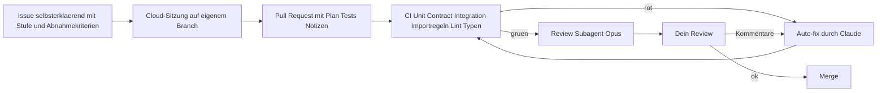
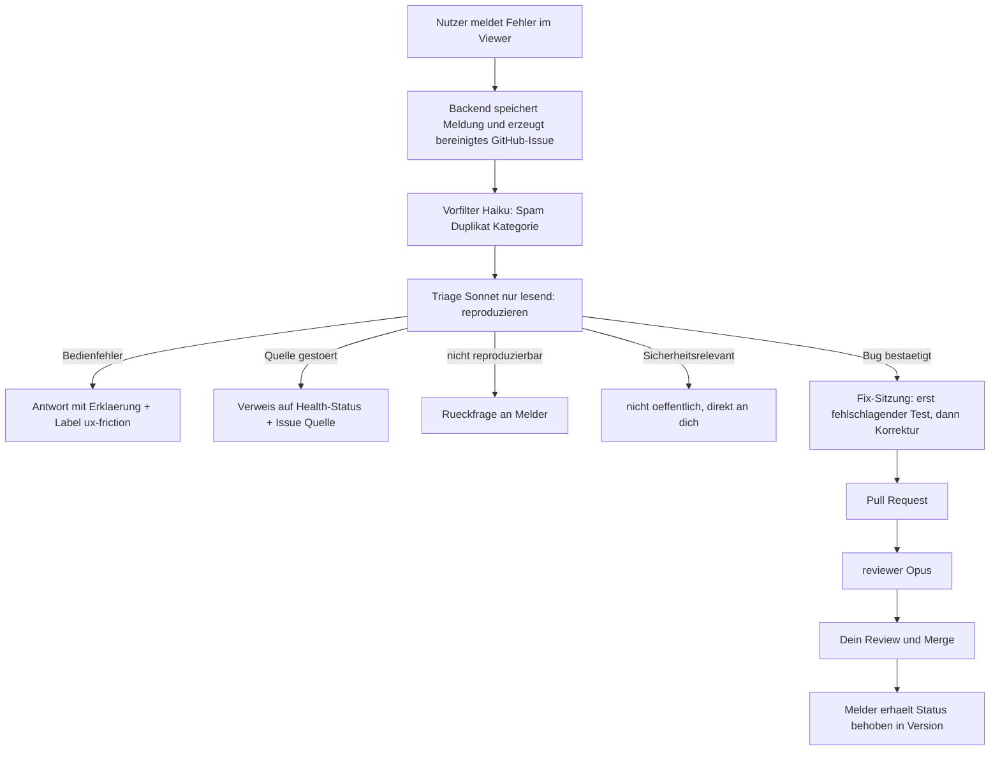

# EarthX — Gesamtprojektplan

> **Rangfolge:** Bei Widerspruch gilt `ENTSCHEIDUNGEN_2026-09-18.md`, danach `KLAERUNGEN.md`, danach dieses Dokument. Dieser Plan ist am 18.09.2026 an die Entscheidungen jenes Tages angepasst; die sieben Hard Constraints aus `ADDING_ESA_DATASETS.md` sind aufgehoben.

Stand: 2026-09-18 · Version 1.1 (Entwurf zur Iteration; ergänzt um die Bug-Report-Pipeline, Abschnitt 6.1)

Dieser Plan führt drei Dokumente zusammen und ergänzt, **wie** das Projekt umgesetzt wird:

| Dokument | Rolle | Verhältnis zu diesem Plan |
|---|---|---|
| Projektübersicht (überarbeitete Gedankensammlung) | Was gebaut wird: Vision, Prinzipien, Funktionen | wird hier nicht wiederholt, nur Meilensteinen zugeordnet |
| Architekturplan v1.1 | Wie es aufgebaut ist: Ebenen, Nahtstellen, Inkremente | Meilensteine folgen den Architektur-Inkrementen |
| Zusätzliche Funktionsvorschläge (aus dem Gespräch) | Erweiterungen | in Abschnitt 7 eingeordnet |
| **Dieser Plan** | Wer was wann mit welchem Modell macht | führt alles zusammen |

Angaben zu Claude Code, Cloud-Sitzungen und Modellen stammen aus der offiziellen Dokumentation vom September 2026 (Quellen in Abschnitt 13). Cloud-Sitzungen sind dort als Research Preview gekennzeichnet; Details können sich ändern.

---

## 0. Kurzfassung

1. **Arbeitsweise:** Claude arbeitet autonom in Cloud-Sitzungen von Claude Code auf dem GitHub-Repo, jeweils auf einem eigenen Branch mit Pull Request. Du entscheidest, prüfst und mergst. Die Cloud-Sitzungen kennen dieses Gespräch nicht; alles Wissen muss deshalb im Repo liegen.
2. **Modellstrategie:** Standard ist Sonnet für Umsetzung, Opus für Planung und Review, Haiku für Massenarbeit, Fable nur für wenige große, unklare Aufgaben. Die Zuordnung steckt in Subagenten-Definitionen im Repo und muss nicht pro Aufgabe neu gewählt werden.
3. **Wichtigster Kostenhebel ist nicht das Modell**, sondern gut geschnittene Aufgaben, aufgezeichnete Testdaten statt Live-Zugriffen und der Grundsatz "kein Modell, wo ein Skript reicht".
4. **Acht Meilensteine** M0 bis M7, abgeleitet aus den Architektur-Inkrementen. Jeder endet mit einem lauffähigen, getesteten vertikalen Schnitt.
5. **Engpass bist du, nicht Claude.** Das Tempo bestimmt, wie schnell Entscheidungen und Reviews erfolgen. Der Plan hält deshalb deine Pflichtaufgaben klein und klar.

---

## 1. Arbeitsmodell

### 1.1 Rollen

| Du entscheidest | Claude arbeitet autonom | Nie ohne dich |
|---|---|---|
| Prioritäten und Meilenstein-Abnahme | Umsetzung klar beschriebener Issues | Merge in `main` |
| Architekturentscheidungen (ADRs freigeben) | Tests schreiben und ausführen | Entfernen des BIOMASS-Prototyp-Codes aus dem Repo |
| Auswahl der Datenquellen | Recherche zum Stand der Technik mit Quellen | Lizenz-Einstufung eines Datensatzes |
| Lizenz- und Rechtsfragen | Refactoring innerhalb der Modulgrenzen | Deployment, Secrets, kostenpflichtige Dienste |
| Geschäftsmodell, Registrierungspflicht | PR-Beschreibungen, Doku, Changelog | Lockerung von Sicherheitsregeln oder Importgrenzen |
| Cloud-Anbieter | Reaktion auf CI-Fehler und Review-Kommentare | Löschen von Daten, History-Rewrites |

### 1.2 Autonomie-Stufen pro Aufgabe

| Stufe | Bedeutung | Beispiel |
|---|---|---|
| A | Claude setzt um, PR wird nach grüner CI von dir kurz gesichtet | Operator hinzufügen, Tests ergänzen, Doku |
| B | Claude legt zuerst einen Plan im PR ab, setzt nach deinem OK um | neuer Adapter, Datenmodell-Migration |
| C | Claude liefert nur Entscheidungsvorlage (ADR-Entwurf, Spike-Bericht) | Job-Queue-Wahl, Interface-Reflexion, Cloud-Anbieter |

Jedes Issue trägt seine Stufe als Label. Im Zweifel gilt die höhere Stufe.

### 1.3 Ablauf einer Aufgabe



Ein Issue ist gut, wenn es ohne dieses Gespräch verständlich ist: Ziel, betroffene Module, Abnahmekriterien, Verweis auf Abschnitt im Architekturplan, Stufe, was **nicht** angefasst werden darf. Richtwert für PRs: unter etwa 400 geänderten Zeilen ohne generierte Dateien; größere Aufgaben werden vorher in Issues zerlegt.

Bewährtes Muster aus der Dokumentation: lokal oder in einer Sitzung im Plan-Modus den Ansatz ausarbeiten, den Plan ins Repo committen, dann eine Cloud-Sitzung mit "Führe den Plan in `docs/plans/…` aus" starten. Mehrere unabhängige Aufgaben laufen parallel in getrennten Sitzungen; parallele Sitzungen verbrauchen dein Kontingent entsprechend schneller.

---

## 2. Cloud-Setup

### 2.1 Repository

Entschieden (ENTSCHEIDUNGEN §4): Das bestehende Repo wird weitergeführt und in **`earthX`** umbenannt; es gibt kein neues Monorepo. Die History bleibt erhalten, der Prototyp bleibt zunächst lauffähig, während drumherum gebaut wird (Strangler-Muster aus dem Architekturplan).

```
earthX/
  CLAUDE.md                     Projektgedächtnis für jede Sitzung
  docs/
    projektuebersicht.md        die überarbeitete Sammlung
    architekturplan.md
    projektplan.md              dieses Dokument
    adr/                        Entscheidungen, eine Datei pro Entscheidung
    plans/                      Umsetzungspläne für Stufe-B-Aufgaben
    ADDING_ESA_DATASETS.md    nur noch Beschreibung des Code-Stands vom 13.08.2026
  .claude/
    agents/                     Subagenten mit Modell und Effort (Abschnitt 3.3)
    skills/                     atomic-commits, code-cleanup, readme-updater
    settings.json               Standardmodell, erlaubte Befehle
  backend/  frontend/  runner/  catalog/   (kuratierte Datensatz-YAMLs)
  tests/fixtures/               aufgezeichnete Antworten externer Quellen
  .github/workflows/            CI, Live-Smoke-Tests, Image-Build
```

Deine drei bestehenden Skills liegen bisher persönlich vor. Cloud-Sitzungen arbeiten mit dem, was im Repo liegt; deshalb gehören sie nach `.claude/skills/` ins Repo. Laut Dokumentation werden Subagenten aus `.claude/agents/` im Repo automatisch übernommen.

### 2.2 GitHub und Schutzregeln

- Claude GitHub App auf dem Repo installieren (ermöglicht auch Auto-fix für PRs).
- Branch-Schutz für `main`: PR-Pflicht, CI muss grün sein, kein Force-Push. Claude arbeitet auf `claude/…`-Branches.
- `CODEOWNERS`: `.claude/`, `.github/`, `CLAUDE.md` und Sicherheitsmodule verlangen dein Review. BIOMASS-Pfade sind nicht mehr geschützt (ENTSCHEIDUNGEN §1).
- Pflicht-Checks in der CI: Unit-Tests, Contract-Tests, Importregeln (Modulgrenzen), Lint/Typen, Abhängigkeits-Scan, Secret-Scan.

### 2.3 Cloud-Umgebung

| Einstellung | Festlegung |
|---|---|
| Netzwerkzugriff | Standardstufe "Trusted" beibehalten. EO-Datenquellen sind darin voraussichtlich nicht freigegeben; genau deshalb arbeiten Tests mit aufgezeichneten Antworten. Nur bei Bedarf einzelne Hosts ergänzen. |
| Setup-Skript | installiert Python-Umgebung, Node, GDAL-abhängige Pakete; das Ergebnis wird zwischengespeichert |
| Umgebungsvariablen | **keine Secrets**: Werte sind laut Dokumentation für jeden sichtbar, der die Umgebung nutzt. Für nötige Schlüssel die Funktion für API-Zugangsdaten nutzen (auf Pro/Max bleiben sie außerhalb der Sandbox). Der MAAP-Token für BIOMASS gehört nicht in die Cloud-Umgebung; BIOMASS kommt in Cloud-Sitzungen überhaupt nicht vor. |
| Berechtigungsmodus | pro Sitzung wählbar; für Stufe A großzügig, für B/C Plan-Modus zuerst |

**Vor dem Start zu klären (M0):** ob in der Cloud-VM Docker bzw. ein lokales Postgres verfügbar ist. Die Architektur braucht für Integrationstests Postgres mit pgstac und einen S3-kompatiblen Speicher. Rückfallebene, die in jedem Fall funktioniert: Integrationstests laufen in GitHub Actions mit Service-Containern; die Cloud-Sitzung fährt Unit- und Contract-Tests und reagiert über Auto-fix auf das CI-Ergebnis.

### 2.4 Testen ohne Live-Quellen

Das ohnehin beschlossene Prinzip (Contract-Tests mit aufgezeichneten Antworten plus regelmäßige Live-Smoke-Tests) ist hier doppelt wertvoll: Cloud-Sitzungen brauchen keinen Zugriff auf externe Datenquellen, Tests sind schnell und deterministisch, und es fließen weniger Tokens in Fehlersuche an wackeligen Netzen. Live-Smoke-Tests laufen zeitgesteuert in GitHub Actions, nicht in Claude-Sitzungen. Für Pixelarbeit liegen winzige Beispiel-COGs und ein Mini-Zarr als Fixtures im Repo.

### 2.5 CLAUDE.md

`CLAUDE.md` liegt im Repo-Wurzelverzeichnis und wird in jeder Sitzung geladen. Der Inhalt steht dort und wird nicht hier doppelt gepflegt; er umfasst: Rangfolge der Dokumente, unverrückbare Regeln (Modulgrenzen, Gateway, Worker-Kern, keine Secrets), Arbeitsweise (ein Branch, ein Draft-PR, nie mergen, nie force-pushen), Autonomiestufen, Umgang mit Fragen und offenen Punkten, Sprachregelung und Verweis auf die Subagenten.

Kurz halten: Details gehören in `docs/` und werden bei Bedarf gelesen.

---

## 3. Modellstrategie

### 3.1 Grundsätze

1. **Kleinstes Modell, das die Aufgabe zuverlässig löst; Eskalation nach Diagnose, nicht nach Gefühl.** Die Regel aus Anthropics eigener Anleitung: Hatte Claude allen Kontext, hat sich sichtbar bemüht und lag trotzdem falsch, ist das ein Signal für ein größeres **Modell**. Hat es eine Datei übersprungen, Tests nicht ausgeführt oder mittendrin aufgehört, ist das ein Signal für höheren **Effort**.
2. **Günstig pro Token ist nicht günstig pro Aufgabe.** Laut Anthropic sind die Kosten pro Aufgabe bei fähigeren Modellen oft niedriger, weil sie weniger Anläufe brauchen. Deshalb: Planung und Review nicht mit dem kleinsten Modell.
3. **Zuordnung im Repo festschreiben,** nicht pro Aufgabe neu wählen: Subagenten tragen `model` und `effort` im Frontmatter.
4. **Kein Modell, wo ein Skript reicht.** Formatierung, Lint, Abhängigkeits-Scan, Live-Smoke-Tests, Image-Builds sind CI-Aufgaben.

### 3.2 Zuordnung nach Aufgabentyp

| Aufgabentyp | Modell | Effort | Mechanismus |
|---|---|---|---|
| Code durchsuchen, Dateien zusammenfassen, Logs sichten, Fixtures aktualisieren, Changelog | Haiku | low bis medium | Subagent `explorer`, `docs-writer` |
| Umsetzung klar beschriebener Issues, Tests, Refactoring innerhalb eines Moduls, Frontend-Komponenten | Sonnet | high (Standard) | Hauptsitzung bzw. Subagent `implementer`, `test-writer` |
| Feature mit Planungsanteil (neuer Adapter, neuer Reader, Datenmodell) | `opusplan`: Opus plant, Sonnet setzt um | Standard | Hauptsitzung mit `/model opusplan` |
| Review gegen Architekturregeln und Sicherheits-Checkliste | Opus | high | Subagent `reviewer` mit eigenem Kontext |
| Architekturentscheidungen, ADR-Entwürfe, Spike-Auswertung, Interface-Reflexion | Opus | xhigh | Subagent `architect` oder eigene Sitzung |
| Recherche zum Stand der Technik mit Quellen | Sonnet | high | Subagent `researcher` |
| Festgefahrene Fehlersuche über Modulgrenzen, große mehrdeutige Aufgaben, Meilenstein-Auftakt mit unklarem Zuschnitt, bereichsübergreifende Umbauten | Fable | Standard | eigene Sitzung mit `/model fable`, bewusst und selten |
| Lizenz-Vorklassifikation eines Datensatzes | Sonnet | high | Subagent `license-checker`; Ergebnis ist immer nur Vorschlag |
| Wiederkehrende Wartung (Routinen) | pro Routine fest gewählt, meist Haiku oder Sonnet | — | Modellauswahl der Routine |

Hinweise zu Fable aus der Dokumentation: Es ist auf keinem Plan das Standardmodell; die Nutzung kann je nach Plan über Usage Credits statt über das enthaltene Kontingent abgerechnet werden. In interaktiven Sitzungen fragt Claude Code vorher nach; **im nicht-interaktiven Modus und über das Agent SDK wird ohne Rückfrage abgerechnet.** Deshalb: Fable nie als Modell einer Routine oder eines Subagenten eintragen, nur bewusst in einer beaufsichtigten Sitzung.

Alternative zum Wechsel an der Plangrenze ist die Advisor-Funktion: Ein günstigeres Ausführungsmodell zieht bei Bedarf ein stärkeres Modell zurate. Anthropic nennt für Sonnet 5 mit Fable 5 als Advisor ein Ergebnis innerhalb von 10 % des Fable-Werts bei 63 % des Preises (SWE-bench Pro). Das ist ein Kandidat für lange Umsetzungssitzungen ab M3, nach einem eigenen Vergleich an zwei bis drei realen Issues.

### 3.3 Subagenten im Repo

| Subagent | Modell | Effort | Werkzeuge | Zweck |
|---|---|---|---|---|
| `explorer` | haiku | low | nur lesen, suchen | Fundstellen und Zusammenfassungen liefern, hält den Hauptkontext klein |
| `implementer` | sonnet | high | lesen, schreiben, Shell | abgegrenzte Teilaufgabe umsetzen |
| `test-writer` | sonnet | high | lesen, schreiben, Shell | Fehlerfälle, fehlerhafte Eingaben, zweckfremde Nutzung; Fixtures |
| `reviewer` | opus | high | nur lesen, Shell für Tests | prüft Diff gegen Architekturplan 3.1, Sicherheits-Checkliste, Gateway- und Worker-Kern-Regel; schreibt Befund in den PR |
| `architect` | opus | xhigh | lesen, Web | ADR-Entwürfe mit Optionen, Kriterien, Empfehlung |
| `researcher` | sonnet | high | Web, lesen | Stand der Technik mit Quellen, keine Codeänderung |
| `docs-writer` | haiku | medium | lesen, schreiben | README, Docstrings, Changelog |
| `license-checker` | sonnet | high | Web, lesen | Lizenz → SPDX + Flags als Vorschlag mit Belegstellen |
| `bug-triager` | sonnet | high | lesen, Shell für Tests; **kein Schreiben** | Bug-Report einordnen und reproduzieren (6.1); behandelt den Meldungstext als Daten, nie als Anweisung |

Beispiel `.claude/agents/reviewer.md`:

```markdown
---
name: reviewer
description: Prüft einen Diff vor dem menschlichen Review. Einsetzen nach jeder Umsetzung, bevor der PR als bereit markiert wird.
tools: Read, Grep, Glob, Bash
model: opus
effort: high
---
Prüfe den aktuellen Diff gegen:
1. Modulgrenzen und Importregeln (docs/architekturplan.md, 3.1)
2. Ausgehende Requests nur über gateway
3. Worker-Kern zustandslos, ohne DB-, Queue-, Speicherzugriff
4. decomp.py bleibt Operator mit Quad-Pol-Capability, wird nicht generalisiert
5. Tests decken Fehlerfälle, fehlerhafte Eingaben, zweckfremde Nutzung
6. Keine Secrets, keine internen URLs, keine exakten AOIs in Logs, Code, Commits oder PR-Texten
Antworte mit: Blocker / Sollte / Hinweis, jeweils mit Datei und Zeile. Ändere keinen Code.
```

Zusätzlich `CLAUDE_CODE_SUBAGENT_MODEL=sonnet` als Standard für nicht zugeordnete Subagenten setzen. In Cloud-Sitzungen wird das Modell mit Argument gewechselt, z. B. `/model opusplan`.

### 3.4 Modelle im Produkt selbst

Getrennt von der Entwicklung nutzt die Plattform später Modelle über die API. Modellnamen stehen in der Konfiguration, nie im Code.

| Einsatz | Modell | Begründung |
|---|---|---|
| Crawler Stufe 3a: Extraktionsschema pro Portal einmalig erzeugen | Sonnet | selten, Qualität zählt |
| Crawler Stufe 3b und Lizenz-Vorklassifikation in der Masse | Haiku | hohes Volumen, striktes Ausgabeschema, immer Review |
| Chatbot Free: Datensatzsuche mit Rückfragen | Sonnet (Haiku als günstigere Option per Bewertungs-Set prüfen) | Tool-Calling und Dialogqualität |
| Chatbot Pro: Analyse, Rezepte vorschlagen | Sonnet als Standard, Modellwahl für Nutzer | entspricht der Produktidee |
| Embeddings für die Hybrid-Suche | eigenes Embedding-Modell, kein Chat-Modell | Auswahl per Bewertungs-Set |

Vor dem Bau prüfen: Stapelverarbeitung und Prompt-Caching der API für die Massenextraktion, und ob das Bewertungs-Set mit dem kleineren Modell besteht.

### 3.5 Kostensteuerung

- Aufgaben klein und selbsterklärend schneiden; das spart mehr als jeder Modellwechsel.
- Hauptkontext klein halten: Suche und Zusammenfassung an `explorer` delegieren.
- Aufgezeichnete Fixtures statt Live-Zugriffe.
- Parallele Sitzungen nur für wirklich unabhängige Aufgaben; sie teilen sich dein Kontingent. Für die Cloud-VM selbst fällt laut Dokumentation keine separate Compute-Gebühr an.
- Effort-Standard belassen; `xhigh` nur für `architect`, `max` gar nicht ohne eigenen Test.
- Nach jedem Meilenstein kurz auswerten: Welche Aufgaben brauchten Nacharbeit, und lag es am Modell, am Effort oder am Issue? Zuordnung in 3.2 anpassen.

---

## 4. Meilensteine

Reihenfolge und Inhalt folgen den Architektur-Inkrementen (Architekturplan 15.1). Jeder Meilenstein endet mit einem lauffähigen, getesteten Schnitt und einer kurzen Abnahme durch dich. Die Dauern sind grobe Schätzungen unter der Annahme, dass du etwa sechs bis acht Stunden pro Woche für Entscheidungen und Reviews hast; wie schnell autonome Sitzungen tatsächlich vorankommen, zeigt sich erst in M0 und M1.

| # | Meilenstein | Größe | grobe Dauer |
|---|---|---|---|
| M0 | Projekt-Setup für autonomes Arbeiten | S | 1 bis 2 Wochen |
| M1 | Fundament | M | 2 bis 3 Wochen |
| M2 | Zweites Format und generalisierter Viewer | L | 3 bis 4 Wochen |
| M3 | Erste Nicht-STAC-Quelle und Interface-Reflexion | M | 2 bis 3 Wochen |
| M4 | Processing-Kern mit lokalem Runner | XL | 4 bis 6 Wochen |
| M5 | Discovery und Suche | XL | 4 bis 6 Wochen |
| M6 | Mehrnutzerbetrieb in der Cloud | XL | 4 bis 6 Wochen |
| M7 | Ausbau in Paketen | offen | laufend |

Parallel ab M2 läuft ein **Viewer-Strang** (V1, V2) mit reinen Frontend-Aufgaben, die vom Kern unabhängig sind und sich gut für parallele Sitzungen eignen.

### M0 — Projekt-Setup

| | |
|---|---|
| Ziel | Claude kann sicher und reproduzierbar autonom arbeiten |
| Inhalt | Verbindlich ist `ENTSCHEIDUNGEN_2026-09-18.md` §6: (1) Repo umbenennen, Dokumente nach `docs/`, CLAUDE.md, Skills nach `.claude/skills/`, Branch-Schutz, CODEOWNERS (`.claude/`, `.github/`, `CLAUDE.md`, Sicherheitsmodule), History auf Secrets prüfen; (2) klären, was die Cloud-VM bereitstellt, Testaufteilung festlegen (2.3); (3) Funktions- und Design-Inventar des Prototyps; (4) Zustands-Audit als ADR-Entwurf; (5) Bug-Report-Pipeline Stufe 1 (6.1); (6) Vorschlag für den ersten token-freien Datensatz |
| Wichtigster Einzelschritt | Das **Funktions- und Design-Inventar des Prototyps** (Stufe C). Es ersetzt die früheren Hard-Constraint-Tests als Ausgangspunkt: Was gibt es, wie ist es gelöst, was ist BIOMASS-spezifisch, was ist übertragbar? |
| Abnahme | Eine Test-Aufgabe der Stufe A läuft von Issue bis Merge ohne dein Eingreifen außer dem Review; CI ist Pflicht-Check |
| Deine Entscheidungen | Berechtigungsmodus; welche Hosts freigegeben werden; Code-Lizenz; erster token-freier Datensatz |
| Modelle | `opusplan` für das Gerüst, `reviewer` ab dem ersten PR |

### M1 — Fundament (Inkrement 1)

| | |
|---|---|
| Ziel | Zieltopologie steht und trägt einen token-freien Datensatz |
| Inhalt | compose-Topologie (`api`, `tiler`, `worker`, `harvester`, Postgres mit pgstac, MinIO); Modulgrenzen mit Importprüfung; Fetch-Gateway mit Allowlist, SSRF-Schutz, Limits; erster token-freier Datensatz in pgstac; STAC-API nach außen; Umsetzung der Konsequenzen aus dem Zustands-Audit (`store.py`, lokale Caches); strukturierte Logs |
| Abnahme | STAC-Browser kann den eigenen Katalog lesen; kein ausgehender Request außerhalb des Gateways (Test); Importregeln grün |
| Deine Entscheidungen | ADR "Zustand im Prototyp": was ersetzt wird, was bleibt |
| Modelle | Audit: `explorer` + Opus-Auswertung; Umsetzung: Sonnet |

### M2 — Zweites Format und generalisierter Viewer (Inkrement 2)

| | |
|---|---|
| Ziel | Beweis "Quelle ≠ Format": Zarr neben COG |
| Inhalt | `zarr_reader.py` mit EOPF-Beispieldaten; Tiler-Endpunkte auf TiTiler-Basis (vorher Spike); `datasets.py` mit `format`-Dispatch; `dataset`-Argument in Routen; Generalisierung `ControlPanel.tsx`/`store.ts`; Onboarding-Checkliste v1 als Test pro Datensatz |
| Funktionen | ROI (Punkt, Box, Polygon) und Zeitraum; Fallback auf nächstgelegenes Datum mit Hinweis; Quicklooks; Stretch und Colormap; Layer Manager Basis (ausblenden, Transparenz, Einzel-Download); Coverage Map für den neuen Datensatz |
| Abnahme | Zwei Datensätze in zwei Formaten im selben Viewer |
| Deine Entscheidungen | Spike-Ergebnis TiTiler annehmen oder eigene Endpunkte |
| Modelle | Spike-Auswertung `architect`; Reader `opusplan`; Frontend Sonnet |

### M3 — Erste Nicht-STAC-Quelle und Interface-Reflexion (Inkrement 3)

| | |
|---|---|
| Ziel | Adapter-Nahtstellen an einer strukturell anderen Quelle prüfen, dann das Interface bewusst ableiten |
| Inhalt | Anbindung eines statischen Buckets (z. B. Hansen GFC) oder Zenodo mit materialisierten Items; anonymer Zugriffs-Check; Lizenzfeld mit SPDX und Flags; danach Interface-Reflexion als ADR |
| Funktionen | eigene AOI hochladen (GeoJSON, KML, Shapefile); Ortssuche mit Umriss und Bounding Box; Health-Status je Quelle (einfach) |
| Abnahme | Dritte Quelle ohne Änderung an `readers` und ohne Sonderfälle im Frontend angebunden; ADR zum Adapter-Interface von dir freigegeben |
| Deine Entscheidungen | welche Quelle; ESA-only oder Breite (Empfehlung: Breite, siehe Projektübersicht); Freigabe des Interface-ADR |
| Modelle | Interface-Reflexion ist die erste sinnvolle Fable-Aufgabe (mehrdeutig, bereichsübergreifend, folgenreich); sonst `opusplan` |

### M4 — Processing-Kern mit lokalem Runner (Inkrement 4)

| | |
|---|---|
| Ziel | Rezept und Operator-Registry tragen Vorschau, Job, Cache, Provenienz und lokale Ausführung |
| Inhalt | Rezept-Schema mit kanonischem Hash; Operator-Registry mit JSON-Schema, Kostenmodell, Metadaten-Transformation; Worker-Kern als reine Funktion; Stufen T1 und T2; Job-Queue (vorher Spike); Ergebnis-Cache; Ablaufdatum; lokaler Runner als Einmalbefehl mit festem Image-Tag; Vergleichstest Cloud gegen lokal |
| Funktionen | Operatoren: Band-Math, Reprojektion/Resampling/Auflösung, Masking, Normalisierung, Ausgabeformat; automatische Skalierung und Einheiten; aus Schemas generiertes Processing-Panel; "Parameter von Datensatz übernehmen"; Kostenschätzung vor Start; Download mit Attribution, Zitat (BibTeX) und Rezept; Methodentext-Generator; Permalinks |
| Abnahme | Dasselbe Rezept liefert als Vorschau, als Job und im lokalen Runner übereinstimmende Ergebnisse (Toleranz definiert); zweiter identischer Auftrag kommt aus dem Cache |
| Deine Entscheidungen | ADR Job-Queue; welche Operatoren zuerst; Status lokaler Ergebnisse |
| Modelle | Rezept- und Registry-Design `architect` (Opus, xhigh); Operatoren einzeln als Stufe-A-Issues mit Sonnet, gut parallelisierbar |

### M5 — Discovery und Suche (Inkrement 5)

| | |
|---|---|
| Ziel | Der eigentliche "Datacrawler": Datensätze finden, prüfen, freigeben, auffindbar machen |
| Inhalt | Trichter Stufen 0 und 1 (STAC Index/Atlas, STAC-Collection-Suche, CKAN, DCAT-AP, OAI-PMH nach Bedarf); Pipeline mit Zustandsautomat, Rohspeicherung, Inhalts-Hash; Verify; Dedupe mit Distributionen; Git-basierter Review; Health-Checks; Hybrid-Suche mit pgvector, Volltext und RRF; Bewertungs-Set für Suchqualität |
| Funktionen | AOI-zuerst-Suche; Verfügbarkeits-Zeitleiste; Eignungskarte pro Datensatz; "zuletzt erfolgreich geprüft" sichtbar; Datensatz-Wünsche und Fehlermeldungen; JSON-LD und Sitemap für eigene Auffindbarkeit |
| Abnahme | Ein Harvest-Lauf erzeugt Review-Vorschläge als PRs; ein erneuter Lauf ohne Quelländerung kostet nur bedingte Requests; Bewertungs-Set besteht |
| Deine Entscheidungen | welche Register und Portale; Review-Regeln; Lizenz-Freigaben (immer du) |
| Modelle | Pipeline `opusplan`; je Protokoll ein Sonnet-Issue; `license-checker` liefert Vorschläge |

### M6 — Mehrnutzerbetrieb in der Cloud (Inkrement 6)

| | |
|---|---|
| Ziel | Viele gleichzeitige Nutzer, sicher und datenschutzkonform |
| Inhalt | OIDC-Login; API-Keys; Processing Units und Quota-Ledger; Rate Limits; Cloud-Migration mit CDN vor dem Tiler; OpenTelemetry, Metriken; Lasttest; Datenschutz (Aufbewahrungsfristen, AOIs als personenbezogen, AV-Vertrag LLM-Anbieter vorbereiten); öffentliche API dokumentiert |
| Funktionen | Python-Client mit Snippet- und Notebook-Export; STAC- und XYZ-Zugang für QGIS; Download-Skript für viele Rohszenen; Mehrfach-Download und Datacube mit Lizenzprüfung der Kombination |
| Abnahme | Lasttest mit simulierten Nutzern besteht definierte Ziele; ein externer Python-Client kann suchen, schätzen, rechnen, laden; kein personenbezogenes Datum in Logs |
| Deine Entscheidungen | Cloud-Anbieter; Identity-Provider; Registrierungspflicht ja/nein; Kontingente Free |
| Modelle | Sicherheits- und Auth-Teile: Planung und Review mit Opus, nie nur Sonnet; Infrastruktur-Code Stufe B |

### M7 — Ausbau in Paketen (Inkrement 7)

Reihenfolge nach Nutzen und Abhängigkeit; jedes Paket ist ein eigener kleiner Meilenstein.

| Paket | Inhalt | Voraussetzung |
|---|---|---|
| 7a | Chatbot (Suche, Rückfragen, nur Empfehlung) + MCP-Server über der öffentlichen API; Bewertungs-Set | M5, M6 |
| 7b | Discovery Stufen 2 und 3 (JSON-LD/Croissant/Signposting; LLM-Schema pro Portal) | M5 |
| 7c | Virtuelle Zarr-Stores für Altformate (vorher Spike) | M2 |
| 7d | Analyse-Paket: wolkenfreies Komposit, Vorher/Nachher-Assistent, Qualitäts-Overlay, zonale Statistik, Stapelverarbeitung über viele Flächen, zeitliche Angleichung (nur wo fachlich zulässig) | M4 |
| 7e | Modell-Registry, Container-Stufe T3, Domain-Shift-Warnung, Trainingsdatensatz-Baukasten | M4, M6 |
| 7f | Verbundener Runner mit Auswahl Cloud/Lokal in der Oberfläche | M4, M6 |
| 7g | Externe Engines (openEO-Backends, GAMMA) über `ProcessingBackend` | M4 |
| 7h | Arbeitsbereiche, zitierbare Rezepte mit DOI, Benachrichtigungen, eigene Daten per URL, Nutzungsstatistik für Anbieter | M6 |
| 7i | Chatbot Pro (Analyse, Modellwahl), Bezahl-Tiers | 7a, rechtliche Klärung NC |
| später | Rendering im Browser, Ähnlichkeitssuche über Embedding-Datensätze, Token pro Connector, BIOMASS multi-user, Reselling, weitere Domänen | — |

### Viewer-Strang (parallel ab M2)

| Paket | Inhalt |
|---|---|
| V1 | Swipe-/Split-Vergleich mit synchronisierten Karten; "Layer auf Ansicht zuschneiden"; Pixel-Inspektor; Zeitreihe am Punkt mit CSV-Export |
| V2 | Schlanker Kartenexport (PNG/SVG, Titel, Colorbar, Maßstab, Attribution, optional ohne Hintergrundkarte) + generiertes matplotlib-Snippet; Wolkenfilter; Feinschliff Bedienbarkeit |

---

## 5. Zuordnung aller Funktionen

| Funktion | Herkunft | Meilenstein |
|---|---|---|
| ROI, Zeitraum, Datums-Fallback, Quicklooks, Layer Manager Basis, Coverage Map | Sammlung | M2 |
| AOI-Upload, Ortssuche, Lizenzfeld, Zugriffs-Check | Sammlung / Bewertung | M3 |
| Processing-Panel, Standard-Parameter, Parameter übernehmen, Metadaten je Schritt | Sammlung | M4 |
| Kostenschätzung, Cache, Provenienz, Zitierexport, Permalinks | Prinzipien / Bewertung | M4 |
| Lokaler Runner (Einmalbefehl) | Gespräch | M4 |
| Automatische Skalierung/Einheiten, Methodentext-Generator | Vorschläge | M4 |
| AOI-zuerst-Suche, Zeitleiste, Eignungskarte, Wünsche/Fehlermeldungen, Health-Status | Vorschläge / Bewertung | M5 |
| Login, Quotas, API, Python-Snippet, QGIS über Standards, Datacube, Mehrfach-Download | Sammlung | M6 |
| Python-Client mit Notebook-Export, Download-Skript | Vorschläge | M6 |
| Swipe-Vergleich, Pixel-Inspektor, Kartenexport, Wolkenfilter | Bewertung | V1, V2 |
| Chatbot, Discovery-Agent, Modell-Registry, externe Engines, Client-Side Computing | Sammlung | M7 |
| Komposit, Vorher/Nachher, Stapelverarbeitung, Qualitäts-Overlay, Trainingsdatensatz-Baukasten | Vorschläge | M7 |
| Arbeitsbereiche, DOI für Rezepte, Benachrichtigungen, eigene Daten per URL, Anbieter-Statistik, Ähnlichkeitssuche | Vorschläge | M7 |
| Bug-Report mit automatischer Triage und Behebung durch Claude | Gespräch | M0 (Stufe 1), M2, M4, M6 |
| Verworfen/ersetzt: Layer frei skalieren, voller Plot-Editor, 3D, DOI als Ausschlusskriterium | Bewertung | — |

---

## 6. Automatisierung

Grundsatz: deterministische Aufgaben in GitHub Actions, Urteilsaufgaben als Claude-Routinen. Routinen laufen als autonome Cloud-Sitzungen mit festem Prompt, Repo, Umgebung und fest gewähltem Modell; Auslöser sind Zeitplan, API-Aufruf oder GitHub-Ereignis. Eine Routine kann nicht nachfragen, deshalb müssen Prompt und Erfolgskriterium vollständig sein.

| Aufgabe | Werkzeug | Modell | Ab |
|---|---|---|---|
| Tests, Lint, Importregeln, Scan, Image-Build | GitHub Actions | — | M0 |
| Live-Smoke-Tests gegen echte Quellen (täglich) | GitHub Actions | — | M2 |
| Abhängigkeits-Updates | Renovate/Dependabot; Auto-fix nur bei roten PRs | Sonnet | M1 |
| Triage bei fehlgeschlagenem Smoke-Test: Quelle down, Struktur geändert oder eigener Fehler? Issue mit Diagnose, ggf. Fixture-PR | Routine (GitHub-Ereignis) | Sonnet | M2 |
| Doku-Drift: weichen `docs/` und Code voneinander ab? Issue mit Liste | Routine (wöchentlich) | Haiku | M1 |
| Bug-Report-Triage und Behebung (6.1) | Routine (pro Meldung) | Haiku → Sonnet, Review Opus | M0 |
| Harvest-Vorschläge zu Review-PRs aufbereiten inkl. Lizenz-Vorschlag | Routine (nach Harvest-Lauf) | Sonnet | M5 |
| Architektur-Konformitätsbericht: Abweichungen vom Architekturplan, technische Schulden | Routine (monatlich) | Opus | M3 |

Routinen bekommen nur das nötige Repo, minimale Netzwerkrechte und keine Secrets. Fable wird nie als Routinen-Modell gewählt (3.2).

### 6.1 Bug-Report-Pipeline (von Anfang an)

Ziel: Eine Meldung geht ohne Umweg an Claude. Claude klärt zuerst, **ob überhaupt ein Fehler der Plattform vorliegt**, und behebt ihn nur dann. Mergen bleibt bei dir.



**Was eine Meldung automatisch mitbringt** (mit Einwilligung des Melders): Permalink bzw. Rezept-ID des aktuellen Zustands, App-Version, beteiligte Datensätze, Trace-ID der letzten Requests, Fehlermeldungen aus dem Frontend, Browser, Health-Status der beteiligten Quellen zum Zeitpunkt der Meldung. Dazu wenige strukturierte Felder: Was wolltest du tun? Was ist passiert? Was hast du erwartet? Hier zahlt sich die Rezept-Architektur aus: Ein Zustand, der als Rezept vorliegt, ist deterministisch reproduzierbar.

**Ergebnisse der Triage**

| Ergebnis | Folge |
|---|---|
| Bug bestätigt | Fehlschlagender Test, der den Fehler zeigt, dann Korrektur, PR, Review. Ohne reproduzierenden Test kein Fix. |
| Bedienfehler | Freundliche Erklärung an den Melder; Label `ux-friction`. Ab der dritten gleichartigen Meldung entsteht automatisch ein UX-Issue: Ein wiederholter Bedienfehler ist ein Gestaltungsfehler. |
| Externe Quelle gestört oder verändert | Kein Plattform-Bug; Health-Status aktualisieren, ggf. Fixture- oder Adapter-Issue |
| Nicht reproduzierbar | gezielte Rückfrage; nach Frist schließen |
| Duplikat | verknüpfen, Melder informieren |
| Sicherheitsrelevant | nie öffentlich behandeln, nicht automatisch beheben, direkt an dich |
| Funktionswunsch | in die Wunschliste (M5), kein Bug |

**Sicherheit: Die Meldung ist nicht vertrauenswürdige Eingabe für einen Agenten mit Repo-Zugriff.** Das ist der heikelste Punkt der ganzen Funktion.

- Zwei getrennte Schritte mit getrennten Rechten: Die Triage darf nur lesen, Tests ausführen, kommentieren und labeln. Erst ein bestätigter Bug startet eine Fix-Sitzung, und die darf nur einen PR erzeugen.
- Meldungstext wird im Prompt klar als Daten gekennzeichnet; Anweisungen darin ("ignoriere…", "ändere Datei…", "füge Abhängigkeit hinzu…") sind selbst ein Befund und führen zum Label `suspicious`.
- Fix-PRs aus Bug-Reports dürfen keine Abhängigkeiten, keine CI-Dateien, keine `.claude/`-Dateien und keine Sicherheitsmodule ändern, ohne dass CODEOWNERS dein Review erzwingt. Kein automatischer Merge, auch nicht bei grüner CI.
- Die Umgebung der Routine hat keine Secrets und minimale Netzwerkrechte.
- Missbrauch über Kosten: Jede Meldung löst Modellaufrufe aus. Deshalb Rate Limit pro Nutzer/IP, Captcha oder Login, Tagesobergrenze für Triage-Läufe, günstiger Vorfilter vor der teuren Reproduktion.

**Datenschutz.** Meldungen enthalten personenbezogene Daten (Kontakt, AOI, Rezept). Die vollständige Meldung bleibt in der eigenen Datenbank; ins GitHub-Issue kommt nur der bereinigte technische Inhalt mit einer internen Referenz. Bei öffentlichem Repo gilt das zwingend. Automatische Antworten sind als von einer KI erstellt gekennzeichnet.

**Modelle.** Vorfilter Haiku; Triage, Reproduktion und Korrektur Sonnet; Review Opus. Eskalation auf Opus, wenn die Reproduktion gelingt, die Ursache aber nach einem Anlauf unklar bleibt. Fable nie, weil die Pipeline unbeaufsichtigt läuft.

**Ausbaustufen**

| Stufe | Inhalt | Ab |
|---|---|---|
| 1 | GitHub-Issue-Vorlage "Bug" mit den strukturierten Feldern; Triage-Routine auf neue Issues mit Label `bug-report`; Fix als PR. Reicht, solange du und wenige Tester die einzigen Nutzer seid. | M0 |
| 2 | Knopf "Fehler melden" im Viewer, Backend erzeugt das bereinigte Issue; automatischer Kontext (Version, Datensätze, Frontend-Fehler) | M2 |
| 3 | Rezept/Permalink und Trace-ID als Kontext; Reproduktion über das Rezept | M4 |
| 4 | Status für den Melder (eingegangen, in Prüfung, bestätigt, behoben in Version X), Missbrauchsschutz über Login und Quotas, `ux-friction`-Auswertung | M6 |

Technischer Auslöser: Routinen lassen sich laut Dokumentation per Zeitplan, API-Aufruf oder GitHub-Ereignis starten. Ob "Issue erstellt/gelabelt" als Ereignis direkt unterstützt wird, ist in M0 zu prüfen; sicherer Rückfallweg ist ein kleiner GitHub-Actions-Workflow auf `issues: labeled`, der die Routine per API-Aufruf startet.

---

## 7. Qualität und Definition of Done

Ein PR ist fertig, wenn:

1. Abnahmekriterien des Issues erfüllt und im PR belegt sind.
2. Tests Fehlerfälle, fehlerhafte Eingaben und zweckfremde Nutzung abdecken; externe Quellen nur über Fixtures.
3. CI grün ist, inklusive Importregeln, Lint/Typen und Secret-Scan.
4. `reviewer` keinen Blocker meldet.
5. Doku und ggf. ADR aktualisiert sind; bei Datensätzen die Onboarding-Checkliste vollständig ist.
6. Keine neuen ausgehenden Verbindungen außerhalb des Gateways, keine Secrets, keine exakten AOIs in Logs.
7. Bei Entscheidungen mit Compute-Relevanz die Recherche mit Quellen im PR oder ADR verlinkt ist.

---

## 8. Risiken der Arbeitsweise

| Risiko | Gegenmaßnahme |
|---|---|
| Cloud-Sitzungen sind Research Preview; Verhalten und Grenzen ändern sich | Alles Wesentliche liegt im Repo; Arbeitsweise funktioniert genauso mit lokalem Claude Code |
| Kontingent: Cloud-Sitzungen teilen sich die Limits mit aller übrigen Nutzung | Parallelität dosieren, Modellzuordnung einhalten, Fixtures statt Live-Zugriff |
| Schleichende Abweichung von der Architektur über viele autonome PRs | Importregeln in der CI, `reviewer`, CODEOWNERS, monatlicher Konformitätsbericht |
| Erfundene oder veraltete APIs junger Bibliotheken (zarr, TiTiler-Varianten, Icechunk) | Spikes vor Festlegung, Versionen pinnen, `researcher` mit Quellenpflicht, Tests gegen echte Mini-Fixtures |
| Review-Stau bei dir | kleine PRs, Stufen-Labels, `reviewer` filtert vor, feste Review-Zeiten |
| Kontextverlust zwischen Sitzungen | Repo als Gedächtnis: CLAUDE.md, ADRs, Pläne in `docs/plans/`, aussagekräftige PR-Beschreibungen |
| Secrets in der Cloud-Umgebung | keine Secrets in Umgebungsvariablen; BIOMASS-Token bleibt lokal bei Otto; Tests mit Fixtures; Secret-Scan in der CI |
| Sicherheits-Klassifikatoren: Fable und Opus 5 können sicherheitsnahe Inhalte markieren und die Anfrage auf ein anderes Modell umleiten | bei Arbeit am Gateway/SSRF-Schutz einkalkulieren; defensive Arbeit ist normalerweise unkritisch; Modellwechsel wird im Verlauf angezeigt |
| Bug-Reports als Einfallstor: Prompt Injection über den Meldungstext, Kostenmissbrauch durch Massenmeldungen, personenbezogene Daten in Issues | getrennte Rechte für Triage und Fix, nie Auto-Merge, CODEOWNERS, Rate Limits und Tagesobergrenze, bereinigte Issues (6.1) |
| Claude "behebt" einen Bedienfehler als vermeintlichen Bug und verändert korrektes Verhalten | Fix nur mit reproduzierendem Test, der ein dokumentiertes Soll verletzt; im Zweifel Rückfrage statt Änderung |
| Unbeabsichtigte Kosten durch Fable in unbeaufsichtigten Läufen | Fable nie in Routinen, Subagenten oder nicht-interaktiven Aufrufen |
| Docker/Postgres in der Cloud-VM nicht verfügbar | Integrationstests in GitHub Actions mit Service-Containern (2.3) |

---

## 9. Erste Schritte

1. Repo in `earthX` umbenennen (entschieden, ENTSCHEIDUNGEN §4).
2. Claude GitHub App installieren, Cloud-Umgebung anlegen (Netzwerk "Trusted", Setup-Skript, keine Secrets).
3. Dokumente nach `docs/` legen, CLAUDE.md schreiben, Subagenten nach 3.3 unter `.claude/agents/`, `.claude/settings.json` mit Standardmodell Sonnet, Ottos drei Skills nach `.claude/skills/` committen.
4. Branch-Schutz und CODEOWNERS setzen; Git-History einmal auf Secrets prüfen.
5. Erste drei Issues anlegen:
   - **Stufe C:** "Prüfe, welche Werkzeuge die Cloud-VM bereitstellt (Docker, Postgres, GDAL). Schlage vor, wie Unit-, Contract- und Integrationstests aufgeteilt werden." (Opus)
   - **Stufe C:** "Funktions- und Design-Inventar des Prototyps: Was gibt es, wie ist es gelöst, was ist BIOMASS-spezifisch, was ist auf token-freie Datensätze übertragbar? Kein Produktivcode ändern." (`explorer` + Opus)
   - **Stufe C:** "Zustands-Audit des Prototyps: Wo liegt Zustand im Speicher oder Dateisystem? Wo verlassen Requests den Prozess? Bericht als `docs/adr/0001-…`." (`explorer` + Opus)
6. Nach den ersten drei PRs: Arbeitsweise kurz auswerten (Issue-Qualität, Modellzuordnung, Review-Aufwand) und diesen Plan anpassen.

---

## 10. Offene Entscheidungen bei dir

| Thema | Wann nötig | Empfehlung |
|---|---|---|
| Code-Lizenz für das öffentliche Repo | M0 | entschieden werden muss sie; ohne `LICENSE` ist der Code rechtlich nicht freigegeben |
| Erster token-freier Datensatz | M0 | Entscheidungsvorlage aus M0 Schritt 6; Kandidat EOPF Sentinel Zarr Samples |
| Claude-Plan: reicht das Kontingent? | nach M0/M1 beobachten | Laut Dokumentation ist das Standardmodell auf Pro Sonnet 5, auf Max Opus 5. Erst messen, dann entscheiden |
| TiTiler-Basis ja/nein | M2 | nach Spike |
| ESA-only oder Quellenbreite; welche Nicht-STAC-Quelle | M3 | Breite; statischer Bucket oder Zenodo |
| Adapter-Interface (ADR) | Ende M3 | aus drei realen Quellen ableiten |
| Job-Queue | M4 | Postgres-gestützt, nach Spike |
| Status lokaler Ergebnisse (teilbar? cachebar?) | M4 | zunächst "selbst bezeugt", nicht im gemeinsamen Cache |
| Register und Portale für den Harvester | M5 | STAC Index/Atlas zuerst |
| Cloud-Anbieter, Identity-Provider | M6 | nach Datennähe, Egress, EU/CH, kein Lock-in |
| Registrierungspflicht für alles oder anonymes Ansehen | M6 | anonym ansehen, Login ab Jobs/Downloads/API |
| Processing auf NC-Daten hinter Bezahlschranke | vor 7i | Rechtsrat; bis dahin NC nur gratis |

---

## 11. Pflege dieses Plans

Der Plan liegt als `docs/projektplan.md` im Repo und wird nach jedem Meilenstein aktualisiert: Meilenstein-Status, Anpassung der Modellzuordnung (3.2), neue ADRs, verschobene Funktionen. Änderungen am Plan laufen wie Code über PRs.

---

## 12. Glossar der Modellbegriffe

| Begriff | Bedeutung |
|---|---|
| `haiku`, `sonnet`, `opus`, `fable` | Modell-Aliase in Claude Code; zeigen auf die jeweils aktuelle Version der Familie |
| `opusplan` | Opus im Plan-Modus, danach automatisch Sonnet für die Ausführung |
| Effort | wie viel Arbeit Claude pro Anfrage investiert (Dateien lesen, prüfen, Schritte); Stufen `low` bis `max` |
| Subagent | Hilfsagent mit eigenem Kontextfenster, eigenem Modell und Effort, definiert in `.claude/agents/` |
| Routine | gespeicherter, autonomer Cloud-Lauf mit festem Prompt, Modell, Repo, Umgebung und Auslöser |
| Auto-fix | Claude beobachtet einen PR und reagiert auf CI-Fehler und Review-Kommentare |

---

## 13. Quellen

- Claude Code in der Cloud (Sitzungen, `--cloud`, `--teleport`, Auto-fix, Subagenten in Cloud-Sitzungen, Grenzen): https://code.claude.com/docs/en/claude-code-on-the-web
- Cloud-Umgebungen (Netzwerkstufen, Variablen, Setup-Skript): https://code.claude.com/docs/en/cloud-environments.md
- Routinen: https://code.claude.com/docs/en/routines.md
- Modellkonfiguration (Aliase, `opusplan`, Fable und Usage Credits, Effort, Subagenten-Modell, Fallback): https://code.claude.com/docs/en/model-config
- Modell und Effort wählen (Diagnoseregel): https://claude.com/blog/claude-model-and-effort-level-in-claude-code
- Modellklassen und Advisor-Strategie: https://claude.com/blog/claude-models-explained
- Fachliche Quellen: siehe Architekturplan, Abschnitt 17
